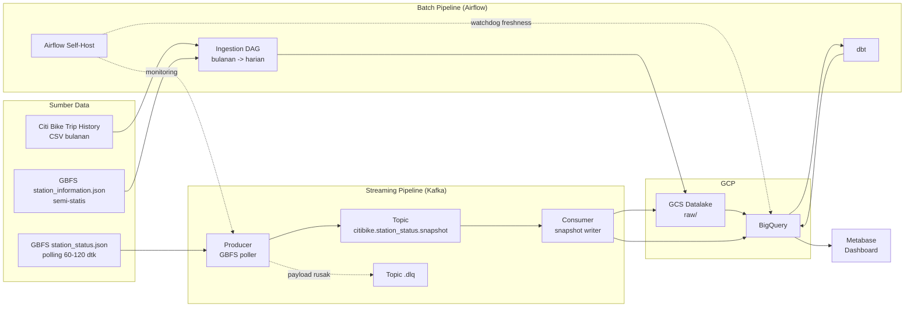
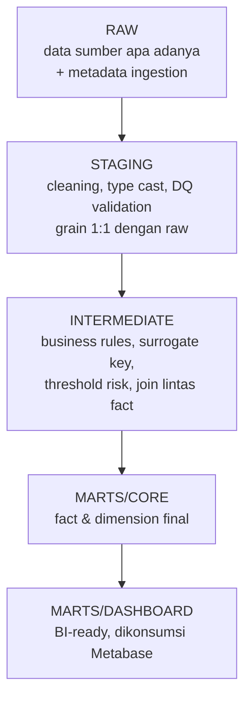
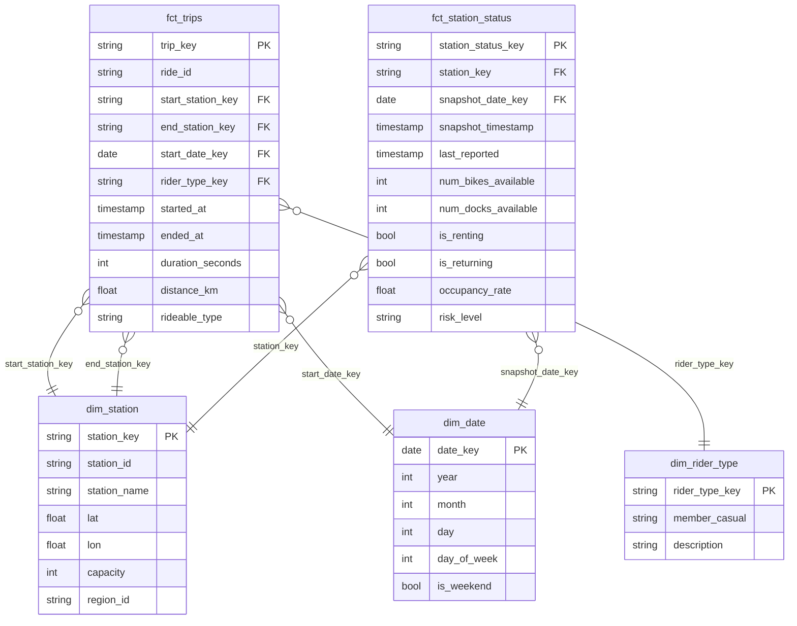
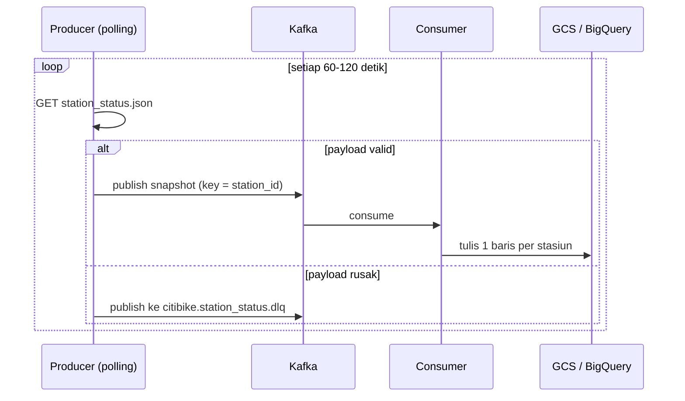

# Arsitektur Pipeline Citi Bike

Dokumen ini merangkum desain arsitektur yang dipakai pada project.
Acuan utama: `Project_Brief_CitiBike_Pipeline.md` §7 (arsitektur) dan §11 (deliverables).

---

## 1. Gambaran End-to-End



---

## 2. Layer Data (medallion)



| Layer | Dataset | Materialisasi | Karakteristik |
|---|---|---|---|
| Raw | `shuhaib_citibike_raw.trips`, `...station_status` | Table (partition + cluster) | Tanpa transformasi bisnis |
| Staging | `shuhaib_citibike_staging.stg_trips` | View | DQ check di sini (§8) |
| Intermediate | `shuhaib_citibike_intermediate.int_*` | View | Belum final, logika bersama |
| Marts/Core | `shuhaib_citibike_marts.fct_trips`, `dim_station` | Table | Grain final |
| Marts/Dashboard | `shuhaib_citibike_dashboard.station_risk_monitoring` | View | Siap untuk BI |

> **Konvensi penamaan dataset.** Project GCP dipakai bersama peserta lain,
> sehingga seluruh dataset diberi prefiks nama pemilik (`shuhaib_`). Ini
> bukan sekadar kerapian: tanpa prefiks, dua peserta dapat memakai nama
> dataset yang sama dan tabelnya saling tercampur dalam satu dataset.
> Nama dataset dibangun otomatis dari `BQ_DATASET_RAW` & `BQ_DATASET_DBT`
> di `.env` (dipakai `dags/common/config.py`, `dbt/profiles/profiles.yml`,
> dan macro `generate_schema_name`), jadi dapat diganti tanpa mengubah kode.
>
> Nama bucket GCS tidak perlu prefiks ini karena nama bucket bersifat
> unik global — mustahil bertabrakan.

> Materialisasi mengikuti strategi biaya brief §12: staging/intermediate/
> dashboard sebagai **view**, marts/core sebagai **table**.

---

## 3. Dimensional Model (Fact Constellation)



**Grain:**

| Tabel | Grain |
|---|---|
| `fct_trips` | 1 baris per trip (transaction fact) |
| `fct_station_status` | 1 baris per stasiun per snapshot polling (periodic snapshot fact) |

**Catatan penting:** karena `fct_station_status` adalah periodic snapshot,
agregasi (occupancy per jam, durasi risk) dilakukan dengan `GROUP BY`
time-bucket, bukan validity window (brief §7).

---

## 4. Alur Streaming — Periodic Snapshot



**Keputusan desain:**

1. **Key = `station_id`** → pesan satu stasiun selalu masuk partisi yang
   sama, sehingga urutan per stasiun konsisten.
2. **Tanpa diff/state store** → seluruh snapshot direkam apa adanya
   (periodic snapshot). Trade-off: volume ~2,2 juta baris/hari, tapi
   jauh lebih sederhana daripada CDC (brief §13).
3. **Setiap baris punya `snapshot_timestamp`** sebagai penanda waktu polling.

---

## 5. Strategi Data Quality (brief §8)

```mermaid
flowchart TD
    IN["Baris masuk"] --> PARSE{"Bisa di-parse?"}
    PARSE -- tidak --> DLQT["Dead Letter Queue<br/>topik .dlq / folder _rejected"]
    PARSE -- ya --> VALID{"Lolos validasi bisnis?"}
    VALID -- tidak --> QUAR["Tabel karantina<br/>stg_*_rejected + rejection_reason"]
    VALID -- ya --> DUP{"Duplikat?"}
    DUP -- ya --> DEDUP["Dedup langsung<br/>QUALIFY ROW_NUMBER()=1<br/>jumlah dicatat sebagai metrik"]
    DUP -- tidak --> OK["stg_* (data valid)"]

    QUAR -. lonjakan >5% .-> ALERT["Alert kegagalan pipeline"]
    DLQT -. .-> ALERT
```

Prinsip: **never silently drop data** — semua yang gagal tetap bisa diaudit.
Lihat brief §8.0 untuk tiga pola penanganan dan retention 30 hari.

### 5.1 Normalisasi station_id (konsistensi lintas era data)

Brief §8.1 meminta pengecekan "Konsistensi `station_id` lintas era data".
Saat verifikasi marts ditemukan **65 stasiun** yang tercatat dengan dua
`station_id` karena perbedaan gaya penulisan digit terakhir:

```
5343.1   Allen St & Hester St   lat=40.71606  lng=-73.99191
5343.10  Allen St & Hester St   lat=40.71606  lng=-73.99191
         ^ nama & koordinat IDENTIK
```

Pengecekan format biasa tidak menangkapnya karena `5343.1` lolos regex
format yang sah. Dampaknya nyata: satu stasiun tampil sebagai dua baris di
dashboard, dan analisis `net_flow` menjadi bias — `5343.1` net −4.645 dan
`5343.10` net +4.536 terlihat "seimbang" padahal gabungannya tidak.

**Solusi:** model `stg_station_id_mapping` memetakan setiap `station_id`
ke id kanonik. Penggabungan hanya dilakukan bila **nama + latitude +
longitude identik** (koordinat dibulatkan 6 desimal) — kriteria koordinat
inilah yang menjaga agar stasiun yang memang terpisah tidak ikut tergabung:

| Kasus | Koordinat | Keputusan |
|---|---|---|
| 65 pasangan artifact | identik | digabung |
| `7625.18` vs `7625.22` (E 118 St & Park Ave) | berbeda | dibiarkan terpisah |
| `8381.04` vs `8421.03` (W 181 St & Riverside Dr) | berbeda | dibiarkan terpisah |

Hasil: 2.352 `station_id` di sumber → **2.287 id kanonik**. Dijaga oleh
uji singular `assert_no_phantom_station_ids.sql`.

> Efek sampingnya positif untuk analisis: nilai `net_flow` ekstrem turun
dari artefak ±4.500 menjadi sinyal nyata +727 / −460.

---

## 6. Mekanisme Alert (brief §11)

### 6.1 Ringkasan sumber alert

| Sumber | DAG / mekanisme | Ambang | Pesan |
|---|---|---|---|
| Batch & transformasi — per task | `default_args.on_failure_callback` | task gagal | spesifik + tautan log |
| Batch & transformasi — per DAG-run | `citibike_watchdog_pipeline` (polling) | DAG-run `failed` | satu ringkasan berisi daftar task |
| Streaming — freshness | `citibike_watchdog_streaming` | data > 10 menit | rantai ujung-ke-ujung |
| Streaming — consumer liveness | `citibike_watchdog_streaming` | objek GCS > 10 menit | consumer berhenti menulis |
| Streaming — DLQ | `citibike_watchdog_streaming` | > 200 baris / 30 menit | payload mulai rusak beruntun |
| Streaming — karantina | `citibike_watchdog_streaming` | > 5% | skema sumber berubah |
| DQ batch (gate) | task `check_quarantine_surge` | > 5% | transformasi dihentikan sebelum naik layer |
| DQ historis | tabel `dq_metrics` | — | riwayat, bukan pemicu |

Semua alert keluar lewat satu jalur: `common/alert_utils.py` → webhook
(Slack), dengan format payload berbeda per jenis.

### 6.2 Dua lapis, bukan satu

Kegagalan tunggal dan kegagalan sistemik butuh perlakuan berbeda, jadi
alert pun dibagi dua lapis:

- **Lapis 1 — per task** (`on_failure_alert`). Pesannya spesifik dan memuat
  tautan log, sehingga bisa langsung ditindaklanjuti. Kunci dedup-nya
  `failure:<dag_id>:<task_id>`, jadi task yang gagal berulang tidak
  mengirim pesan berulang.
- **Lapis 2 — per DAG-run** (`alert_dag_run_failed`). Satu pesan berisi
  daftar lengkap task yang gagal. Ini yang menjaga Slack tetap terbaca
  ketika `citibike_ingest_trips` mengalami kegagalan sistemik: ia punya
  puluhan task paralel, dan tanpa lapis ini Slack menerima puluhan pesan
  karena kunci dedup lapis 1 berbeda per task.

### 6.3 Kenapa lapis 2 memakai polling, bukan `on_failure_callback` tingkat DAG

Pendekatan yang jelas adalah memasang `on_failure_callback` pada DAG.
Pendekatan itu **sudah dicoba dan terbukti tidak bisa diandalkan** di
Airflow 2.9.3, sehingga diganti.

Sebabnya ada di `DAG.fetch_callback`, yang membangun konteks callback dari
**satu task instance sembarang**:

```python
ti = tis[-1]  # get first TaskInstance of DagRun
context = ti.get_template_context(session=session)
```

Untuk DAG yang memakai **dynamic task mapping** — dan `citibike_ingest_trips`
memakainya di dua tempat, karena jumlah partisi baru diketahui saat run —
pemanggilan itu melempar:

```
airflow.models.expandinput.NotFullyPopulated:
    Failed to populate all mapping metadata; missing: 'fname'
```

Callback tidak pernah terkirim, dan jejaknya hanya muncul sebagai
`ERROR - Error executing DagCallbackRequest callback` di log DAG processor.
Ini kegagalan senyap: alert tampak terpasang, tetapi tidak pernah berbunyi.
Terverifikasi pada run `uji_gagal_alert_1` (2026-09-13) — run gagal, tidak
ada pesan terkirim.

Dua cacat lain dari pendekatan callback, yang ikut hilang dengan polling:

1. **Ringkasannya bisa keliru.** Saat callback dipanggil, task yang gagal
   masih berstatus `up_for_retry`, bukan `failed`. Pesan pernah terkirim
   dengan isi `failed_tasks: []` — justru membingungkan.
2. **Callback bisa diproses berulang.** Teramati 6 kali untuk satu run,
   sehingga pesan berpotensi terkirim berkali-kali.

`citibike_watchdog_pipeline` membaca metadata Airflow langsung, sehingga
tidak bergantung pada bentuk konteks apa pun. Ia baru melapor setelah
DAG-run benar-benar berstatus `failed`, jadi daftar task yang dilaporkan
sudah final. Terbukti mampu menyebut task hasil mapping
(`split_and_upload`, `load_partition`) yang justru membuat callback gagal.

### 6.4 Pembatas agar Slack tidak dibanjiri

Airflow sendiri tidak membatasi laju alert; Slack membatasi sekitar
1 pesan/detik. Tiga pembatas dipasang berurutan di `common/alert_throttle.py`:

| Pembatas | Nilai default | Fungsi |
|---|---|---|
| Dedup | 3600 detik | alert dengan kunci sama tidak diulang |
| Rate limit | 3 detik | menjaga batas keras Slack |
| Burst guard | 5 pesan / 60 detik | membatasi badai alert kegagalan task |

Jendela dedup (3600 detik) sengaja disamakan dengan jendela pencarian
DAG-run gagal di `citibike_watchdog_pipeline` (60 menit). Bila jendela dedup
lebih pendek, satu run gagal yang sama akan dilaporkan berulang kali —
teramati 3 kali per jam sebelum keduanya diselaraskan. Dengan nilainya
sama, tiap kegagalan dilaporkan **tepat sekali**; alert per task harian
tetap terkirim setiap hari karena jaraknya jauh lebih besar dari satu jam.

Status ketiga pembatas disimpan di Airflow Variable, bukan di memori
proses. Dengan begitu pembatasnya tetap berlaku lintas proses task dan
lintas restart — termasuk saat 91 task paralel dieksekusi di proses yang
berbeda.

Burst guard hanya berlaku untuk alert per task. Ringkasan DAG-run dan
peringatan watchdog **melewatinya**, karena justru keduanya sumber
informasi utama saat badai alert terjadi.

### 6.5 Retention data operasional

Dijalankan `citibike_retention_cleanup` setiap Minggu 03:00.

| Tabel | Retensi | Alasan |
|---|---|---|
| `station_status` | 14 hari | mart hanya memakai snapshot terakhir; tren cukup hitungan hari |
| `station_status_dlq` | 30 hari | cukup lama untuk memeriksa pola payload rusak |

Tabel karantina dbt **tidak** dibersihkan di sini: keduanya bermaterialisasi
**view**, sehingga tidak menyimpan data sendiri dan masa hidupnya otomatis
mengikuti tabel raw. View juga memang pilihan yang tepat, karena
`check_quarantine_surge` menghitung rasio baris ditolak per eksekusi dbt —
bila tabelnya diakumulasi, pembilang rasio ikut memuat baris yang sudah
lama ditolak dan hasilnya salah.

Efek retensi dibuktikan, bukan diasumsikan: baris sintetis berusia 20 hari
dan 40 hari disisipkan, lalu terbukti terhapus, sementara seluruh data asli
tetap utuh.

### 6.6 Batas yang perlu disadari

Seluruh mekanisme di atas berjalan **di dalam** Airflow. Karena itu tidak
ada satu pun yang bisa melaporkan bahwa Airflow sendiri yang mati: bila
scheduler berhenti, watchdog ikut berhenti dan tidak ada alert dikirim.
Keheningan tidak boleh disalahartikan sebagai "semua sehat". Untuk menutup
celah ini diperlukan pemantauan dari luar (mis. uptime monitor yang mengecek
endpoint health scheduler) — di luar cakupan proyek ini, tetapi perlu
disebut agar batasnya jelas.

---

## 7. Struktur Folder Service

| Folder | Peran | Container |
|---|---|---|
| `dags/` | DAG Airflow + helper (`common/`) | airflow-scheduler |
| `streaming/producer/` | Poll GBFS → Kafka | streaming-producer |
| `streaming/consumer/` | Kafka → GCS/BigQuery | streaming-consumer |
| — (image bawaan `kafbat/kafka-ui`) | Inspeksi topik, partisi, lag & isi pesan Kafka | kafka-ui |
| `dbt/` | Transformasi raw → marts | (di dalam image Airflow) |
| `sql/` | DDL & query operasional | — |
| `infra/` | Setup GCP sekali jalan | — |

Rincian cara menjalankan ada di [`runbook.md`](./runbook.md).

---

## 8. Lapisan CDC (snapshot-diff)

### 8.1 Keluarga CDC yang tersedia untuk sumber ini

CDC bukan satu teknik, melainkan kategori. Empat keluarganya:

| Keluarga | Cara kerja | Tersedia di sini? |
|---|---|---|
| Log-based (Debezium) | Membaca WAL/binlog database sumber | ❌ **Tidak** |
| Trigger-based | Trigger menulis tabel perubahan | ❌ Tidak |
| Timestamp-based | `WHERE updated_at > ?` | ❌ Tidak |
| **Snapshot-diff** | Membandingkan dua keadaan berurutan | ✅ **Ini yang dipakai** |

Tiga keluarga pertama memerlukan akses ke database sumber, sedangkan sumber
di sini adalah REST endpoint GBFS yang hanya mengembalikan keadaan penuh —
tanpa WAL, tanpa trigger, dan tanpa kolom `updated_at` per catatan. Jadi
snapshot-diff bukan sekadar pilihan, melainkan satu-satunya yang mungkin.

**Yang perlu dipahami: resolusi waktunya tidak kalah.** Keunggulan utama
log-based CDC adalah menangkap setiap mutasi, termasuk yang terjadi di antara
dua pembacaan. Keunggulan itu hilang di sini karena mutasinya sendiri berasal
dari polling 90 detik — worker hanya melihat keadaan tiap 90 detik, sehingga
WAL hanya akan mencatat apa yang worker tulis. Semua keluarga CDC mencatat
tingkat perubahan yang sama.

### 8.2 Dua model, dua peran

```
fct_station_status            (jendela kerja — seluruh snapshot, retensi pendek)
        │
        ├─► int_station_status_changes  (arsip — HANYA perubahan, incremental)
        │           │
        │           └─► int_station_status_windows  (validity window + durasi)
        │
        └─► mart dashboard (tidak berubah)
```

| Model | Materialisasi | Peran |
|---|---|---|
| `int_station_status_changes` | incremental, `insert_overwrite` | Arsip perubahan jangka panjang |
| `int_station_status_windows` | view | Menambah `valid_to` + `duration_minutes` |

Pemisahan peran ini penting: `fct_station_status` adalah **jendela kerja**
yang boleh dipangkas retensinya, sedangkan arsip perubahan disimpan terpisah
sehingga tidak ikut terpangkas.

### 8.3 Keputusan teknis yang menentukan hasilnya

Empat hal berikut ditemukan lewat pengujian, dan masing-masing sempat
menghasilkan data yang **salah** sebelum diperbaiki:

**1. Kunci diff wajib `gbfs_station_id`, bukan `station_key`.**

Di `fct_station_status`, `station_key` bernilai NULL untuk 82.531 baris
(9,9%) — stasiun yang ada di feed GBFS tetapi tidak punya riwayat trip
(`is_unknown_station = TRUE`). Seluruh baris itu masuk ke **satu** partisi
`LAG()`, sehingga perubahan antar stasiun berbeda tercampur.
Terverifikasi: 82.183 dari 139.582 baris (59%) salah karena sebab ini.

`gbfs_station_id` tidak pernah NULL (0 baris, 2.450 nilai unik).

Ini menegaskan peran `dim_station` sebagai jembatan antar ruang id:
`station_key` adalah kunci untuk bergabung ke dimensi, sedangkan
`gbfs_station_id` adalah identitas stasiun itu sendiri.

**2. Benih (seed) diperlukan agar rotasi tidak menghasilkan event palsu.**

`LAG()` hanya melihat baris di dalam dataset input. Tanpa benih, baris
pertama tiap batch tidak punya pendahulu sehingga dianggap "stasiun baru" —
dan setiap rotasi menghasilkan ~2.450 event `op='c'` palsu. Benihnya diambil
dari **satu snapshot di batas pemrosesan terakhir**, bukan per stasiun, agar
stasiun yang belum pernah berubah ikut tercakup.

**3. `copy_partitions=True` wajib.**

Adapter BigQuery hanya menerima `merge` dan `insert_overwrite`. Tanpa
`copy_partitions`, `insert_overwrite` **mengganti seluruh partisi** yang
tersentuh sehingga perubahan lain di tanggal yang sama terhapus.

**4. Join di akhir memaksa pemindaian ganda.**

Versi awal membawa kolom metadata lewat `LEFT JOIN` ke `fct_station_status` di
akhir query, sehingga tabel itu dipindai **dua kali**. Setelah metadata dibawa
sejak CTE sumber, biaya per run turun:

| | Sebelum | Sesudah |
|---|---|---|
| Run incremental | 130,2 MiB | **28,1 MiB** |
| Per bulan (720 run) | ~94 GB | **~20 GB** |

### 8.4 Angka nyata

| Metrik | Nilai |
|---|---|
| Rasio perubahan | **7,26%** (60.807 dari 837.683 baris) |
| Stasiun tercakup | 2.450 |
| `op='c'` | 2.450 (= jumlah stasiun, konsisten) |
| `op='u'` | 58.357 |
| Interval ditandai celah data | 24.063 (39,6%) |
| Dwell time (setelah celah disaring) | median **1 menit**, p90 7 menit, maks 10 menit |

### 8.5 Batas yang perlu disadari

**"Tidak ada perubahan" dan "tidak ada data" tampak identik.** Keduanya
menghasilkan satu interval panjang yang sama. Terverifikasi: 3.964 menit yang
semula tampak sebagai dwell time terpanjang ternyata **artefak celah data** —
semuanya berawal pada timestamp yang sama, yaitu titik streaming berhenti.

Karena itu `int_station_status_windows` menyediakan `is_possible_gap`, dan
kolom itu **harus disaring** sebelum `duration_minutes` dipakai:

```sql
WHERE duration_minutes IS NOT NULL AND NOT is_possible_gap
```

Setelah disaring, dwell time yang tersisa (median 1 menit) baru bermakna.

**Delta menjadi satu-satunya arsip jangka panjang.** Sebelumnya riwayat
tersimpan ganda (raw + fct) sehingga bug di satu tempat tidak fatal. Setelah
`fct` dipangkas, redundansi itu hilang — itulah alasan test
`assert_station_status_changes_single_create` ada.
