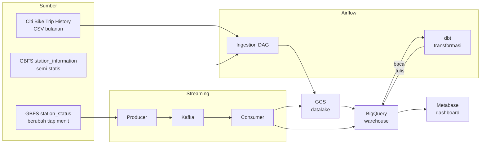
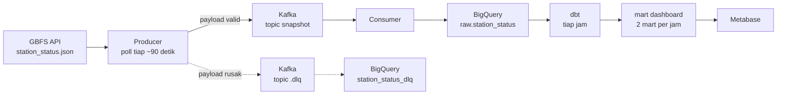
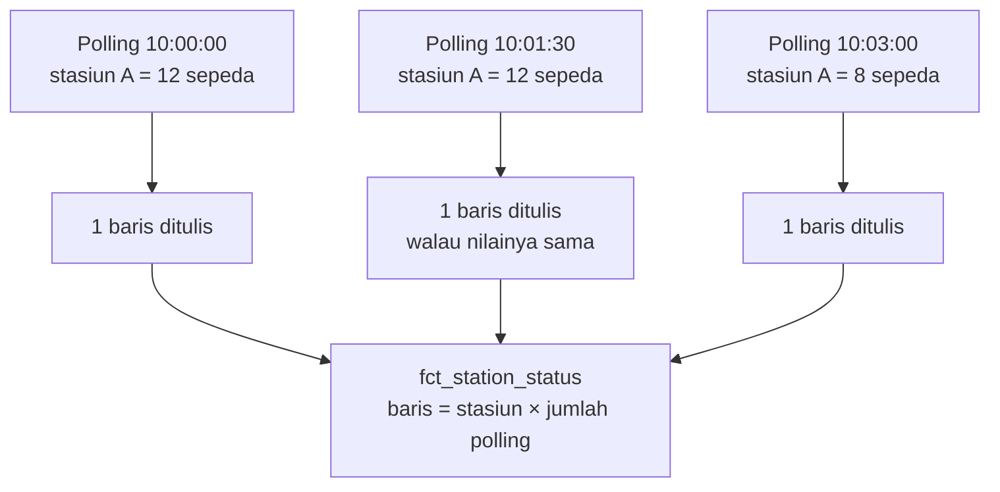
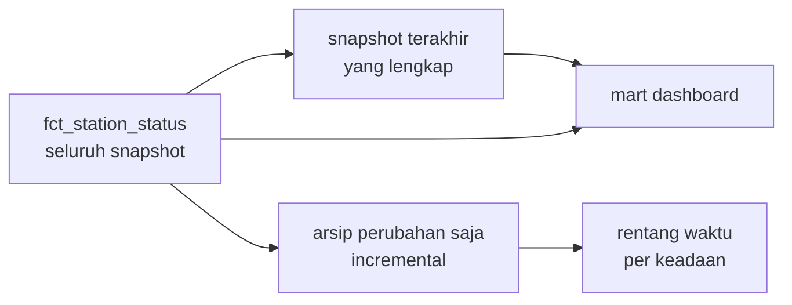
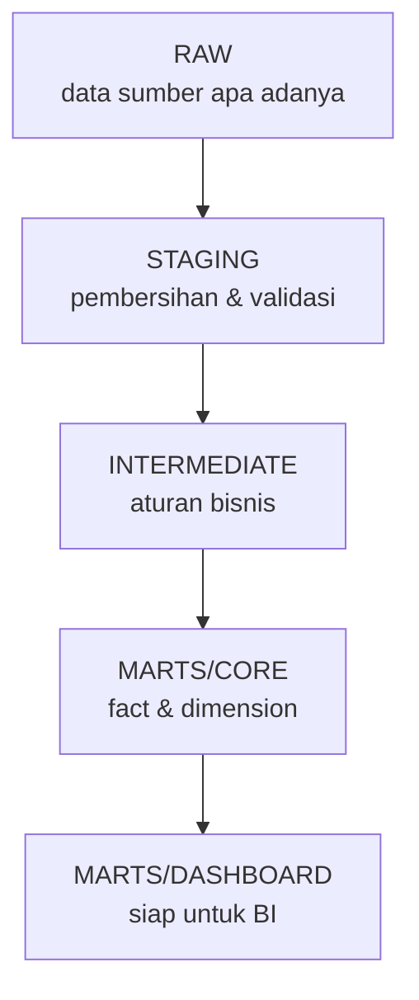
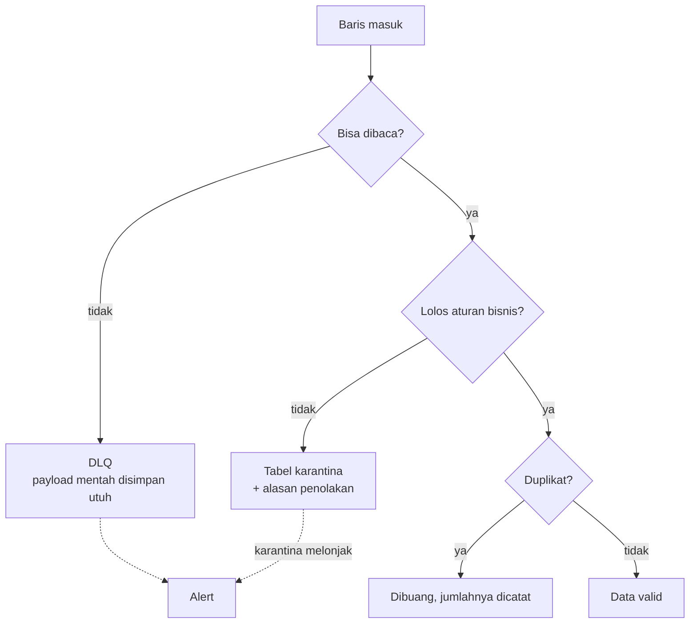

# Arsitektur Pipeline Citi Bike

Dokumen ini menjelaskan **bentuk arsitektur** dan alasan di balik keputusan
utamanya. Satu alur dibahas dalam satu bagian, ditutup dengan batas yang perlu
disadari.

| Ingin tahu lebih dalam | Lihat |
|---|---|
| Relasi & kolom setiap tabel | [`erd.md`](./erd.md) |
| Cara menjalankan & menangani masalah | [`runbook.md`](./runbook.md) |

---

## 1. Gambaran End-to-End

Ada **dua alur** karena sumber datanya dua sifat: riwayat trip terbit sebagai
berkas bulanan, sedangkan status stasiun berubah terus-menerus.

**Kedua alur bertemu di BigQuery.** Batch mengisi tabel trip, streaming
mengisi tabel status stasiun, dan keduanya diproses memakai tool transformasi
yang sama sehingga definisi metriknya tidak bercabang.

---

## 2. Kenapa Dua Alur, Bukan Satu

| | Batch | Streaming |
|---|---|---|
| Sumber | CSV bulanan | REST API yang di-poll |
| Sifat data | Historis, sudah lengkap | Terus berubah |
| Pemicu | Berkas baru tersedia | Selang waktu (polling) |
| Cadangan bila mati | Tidak masalah — bisa diulang | Data yang lewat hilang permanen |

Perbedaan yang terakhir itu yang menentukan desainnya. Berkas CSV bisa
di-ingest ulang kapan saja, sedangkan satu snapshot status stasiun hanya
berlaku pada saat itu. Karena itu alur streaming dilengkapi pemantauan
kesegaran data (§6), sementara alur batch tidak memerlukannya.

---

## 3. Alur Streaming

### 3.1 Jalur satu snapshot

Tiga hal yang perlu diperhatikan dari diagram itu:

- **Producer dan consumer terpisah.** Producer hanya bertugas mengambil data
  dan melempar ke Kafka. Bila BigQuery sedang bermasalah, producer tetap
  berjalan dan datanya tertahan di Kafka — bukan hilang.
- **Payload rusak tidak membuang pesan sebelumnya.** Ia disalurkan ke topic
  DLQ tersendiri, sehingga satu payload cacat tidak menghentikan aliran.
- **dbt berjalan terpisah dari consumer.** Consumer menulis apa adanya;
  perhitungan risiko dan mart dikerjakan dbt setelahnya. Dengan begitu
  perubahan logika bisnis tidak mengharuskan consumer dinyalakan ulang.

### 3.2 Yang membuat streaming berbeda: satu stasiun, banyak baris

Ini bagian yang paling sering salah dipahami, dan alasannya ada di sifat
datanya.

Setiap polling merekam **seluruh** stasiun, bukan hanya yang berubah. Jadi
jumlah baris tumbuh sebesar jumlah stasiun setiap ~90 detik.

Pilihan ini disengaja: tabelnya menjadi *periodic snapshot*. Ia menjawab
"bagaimana kondisi seluruh jaringan pada pukul 10:00" — pertanyaan yang tidak
bisa dijawab tabel yang hanya mencatat perubahan. Konsekuensinya volume
datanya besar, dan itu ditangani lewat masa simpan (§8).

Karena grainnya satu baris per stasiun per waktu, analisis durasi dilakukan
dengan `GROUP BY` per bucket waktu, bukan dengan rentang validitas.

### 3.3 Lapisan turunannya

Rantai setelah `fct_station_status` dipakai untuk dua keperluan berbeda:

- **Snapshot terakhir yang lengkap** dipakai mart. Ini perlu karena penulisan
  consumer bisa terputus di tengah, sehingga snapshot terakhir belum tentu
  memuat seluruh stasiun.
- **Arsip perubahan** menyimpan hanya baris yang berubah, untuk menjawab
  pertanyaan seperti "berapa lama sebuah stasiun bertahan kosong".
- **Rentang waktu per keadaan** menambahkan waktu berakhir pada tiap
  perubahan, sehingga durasinya bisa dihitung.

---

## 4. Layer Data

| Layer | Dataset | Sifat |
|---|---|---|
| Raw | `shuhaib_citibike_raw` | Tanpa transformasi bisnis, hanya ditambah metadata ingestion |
| Staging | `shuhaib_citibike_staging` | Grain 1:1 dengan sumber; validasi bisnis di sini |
| Intermediate | `shuhaib_citibike_intermediate` | Logika yang belum final dan dipakai bersama |
| Marts/Core | `shuhaib_citibike_marts` | Definisi final; jadi dasar foreign key |
| Marts/Dashboard | `shuhaib_citibike_dashboard` | Satu tabel per chart |

**Materialisasi mengikuti rasio build terhadap baca.** BigQuery menagih bytes
yang dipindai, bukan jumlah query, sehingga model yang dibangun sekali lalu
dibaca berkali-kali disimpan sebagai *table*; yang dibaca jarang tetap *view*.
Satu tabel arsip perubahan memakai *incremental* karena isinya bertambah
sepanjang waktu.

> Project GCP dipakai bersama peserta lain, jadi setiap dataset diberi prefiks
> nama pemilik. Nama bucket GCS tidak perlu prefiks karena nama bucket sudah
> unik secara global.

---

## 5. Data Quality

Prinsipnya satu: **tidak ada data yang dibuang diam-diam.** Setiap kegagalan
punya tempat penampungannya sendiri, sesuai sifat masalahnya.

Tiga pola itu dipilih karena sifatnya berbeda:

| Masalah | Perlakuan | Alasan |
|---|---|---|
| Tidak bisa dibaca | DLQ, payload disimpan utuh | Datanya belum pernah terbaca, jadi tidak bisa dipulihkan dari tempat lain |
| Melanggar aturan bisnis | Tabel karantina + alasan | Datanya ada, tetapi tidak boleh masuk ke tabel bersih |
| Duplikat | Dibuang di tempat | Datanya masih ada di sumber, cukup dicatat jumlahnya |

Aturan validasi yang sama dipakai oleh tabel bersih **dan** tabel karantina,
sehingga keduanya tidak mungkin berbeda pendapat.

Selain itu, validasi juga berjalan sebagai **gate**: bila rasio baris
dikarantina melampaui ambang, transformasi dihentikan sebelum data
mencurigakan itu naik ke dashboard.

---

## 6. Pemantauan

Kegagalan tunggal dan kegagalan sistemik butuh perlakuan berbeda, jadi alert
dibagi dua lapis:

| Lapis | Cakupan | Bentuk pesan |
|---|---|---|
| Per task | satu task gagal | spesifik, memuat tautan log |
| Per DAG-run | satu run gagal | satu ringkasan berisi daftar task yang gagal |

Lapis kedua perlu karena satu DAG bisa punya puluhan task paralel — tanpa itu,
kegagalan sistemik mengirim puluhan pesan dan Slack jadi tidak terbaca.

Untuk streaming, ada tambahan pemantauan berupa **kesegaran data**: bila
snapshot terakhir sudah terlalu lama, itu tanda pipeline berhenti di
tengah jalan. Pemeriksaan ini penting justru karena masalah pada streaming
tidak memunculkan error — datanya hanya berhenti bertambah.

Alert keluar lewat satu jalur yang sama untuk semua sumber, dan diberi
pembatas agar tidak membanjiri Slack: alert dengan isu yang sama tidak diulang
dalam jangka waktu tertentu.

---

## 7. Struktur Service

| Folder | Peran | Container |
|---|---|---|
| `dags/` | DAG Airflow + helper | airflow-scheduler |
| `streaming/producer/` | Poll GBFS → Kafka | streaming-producer |
| `streaming/consumer/` | Kafka → GCS & BigQuery | streaming-consumer |
| — | Inspeksi topik & lag Kafka | kafka-ui |
| `dbt/` | Transformasi raw → marts | di dalam image Airflow |
| `sql/` | DDL & query operasional | — |
| `infra/` | Setup GCP sekali jalan | — |

---

## 8. Batas yang Perlu Disadari

Tiga hal berikut bukan kekurangan yang terlewat, melainkan batas yang dipilih
secara sadar. Ketiganya perlu disebut agar tidak disalahartikan.

**1. Pemantauan berjalan di dalam Airflow, sehingga tidak bisa melaporkan
Airflow sendiri yang mati.** Bila scheduler berhenti, watchdog ikut berhenti
dan tidak ada alert yang dikirim. Untuk menutup celah ini diperlukan
pemantauan dari luar, yang berada di luar cakupan project ini.

**2. "Tidak ada perubahan" dan "tidak ada data" tampak identik.** Keduanya
menghasilkan satu rentang waktu panjang yang sama. Karena itu rentang yang
terlalu panjang ditandai secara eksplisit dan **harus disaring** sebelum
durasinya dipakai. Tanpa saringan itu, analisis durasi didominasi artefak
matinya streaming.

**3. Pemrosesan ulang data status stasiun dibatasi masa simpan tabel mentah.**
Tabel `raw.station_status` dipangkas berkala karena volumenya besar — sekitar
2.450 baris setiap polling. Konsekuensinya berlapis, dan lapisan keduanya yang
mudah terlewat:

- **Pemrosesan ulang** yang menuntut data mentah hanya mungkin dilakukan untuk
  periode yang masih berada dalam masa simpan.
- **`fct_station_status` ikut terkena batas yang sama.** Ia bermaterialisasi
  `table` dan dibangun ulang penuh dari `stg_station_status` setiap `dbt run`.
  Karena `stg_station_status` membaca `raw.station_status` yang sudah dipangkas,
  riwayatnya tidak bisa lebih panjang daripada `raw` — bukan karena ada yang
  menghapus barisnya, melainkan karena sumbernya memang sudah tidak lengkap lagi.
- **Histori jangka panjang karena itu hanya ada di arsip perubahan**
  (`int_station_status_changes`). Itu memang tujuan arsip tersebut, dan
  sekaligus alasan ia disimpan terpisah dari snapshot.

Riwayat trip tidak terkena batas ini karena datanya sudah final.
