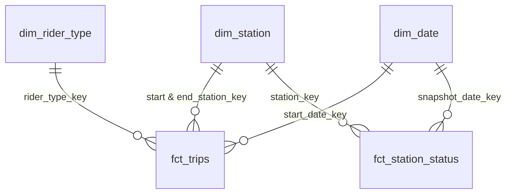
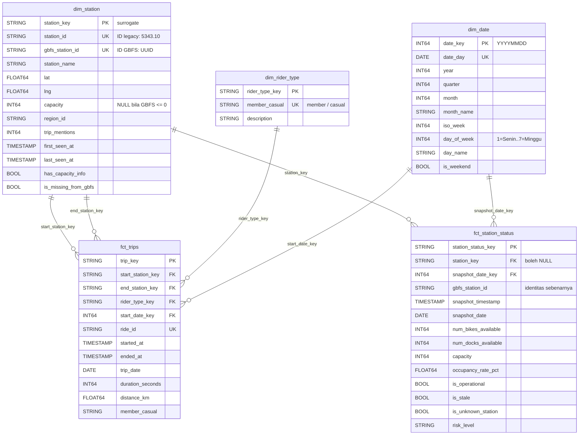
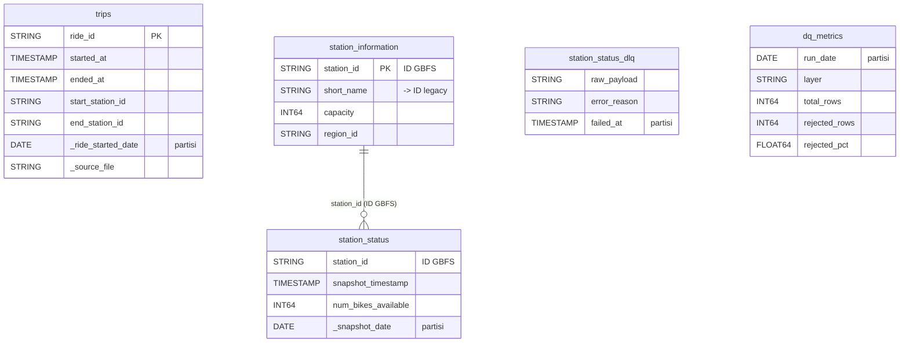
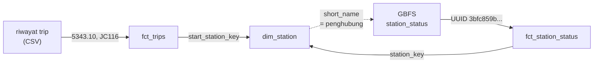
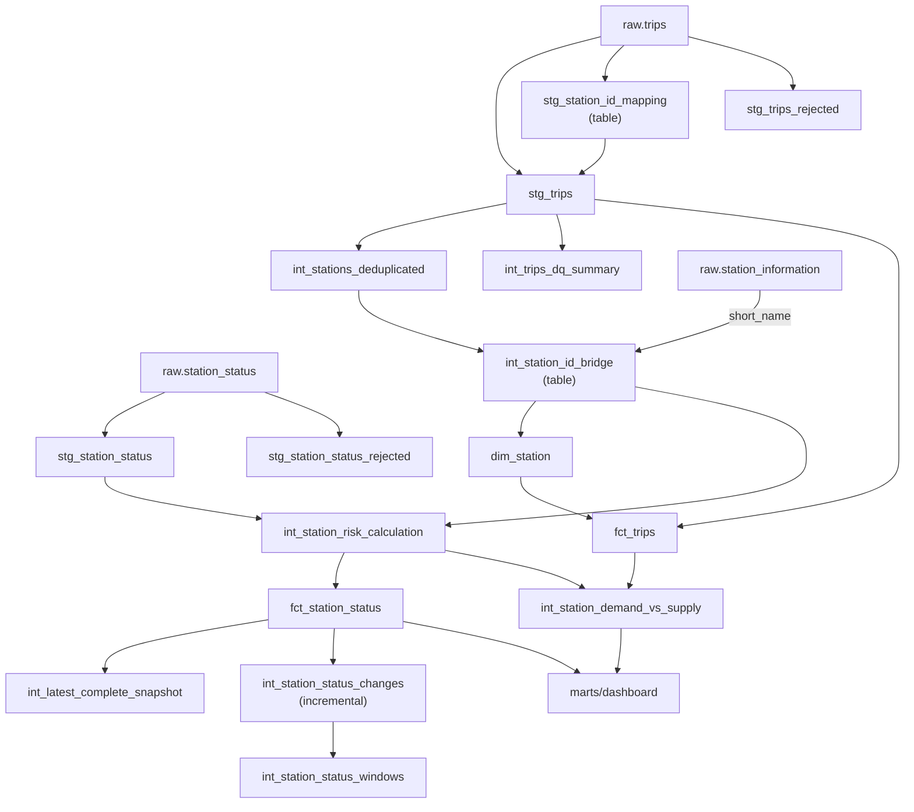

# ERD — Entity Relationship Diagram

Skema yang dipakai: **fact constellation** — dua fact table berbagi dua
dimensi.

---

## 1. Ringkasan relasi



| Fact | Tipe | Grain |
|---|---|---|
| `fct_trips` | Transaction fact | 1 baris per perjalanan |
| `fct_station_status` | Periodic snapshot fact | 1 baris per stasiun per polling |

Perbedaan tipe itu menentukan cara beragregasi: periodic snapshot memakai
`GROUP BY` bucket waktu, bukan validity window.

`dim_rider_type` hanya relevan untuk `fct_trips`, sedangkan `dim_station` dan
`dim_date` dipakai kedua fact.

---

## 2. Detail kolom



---

## 3. Layer raw



Catatan: `trips` tidak terhubung langsung ke tabel mana pun di layer raw.
Penghubungnya baru terbentuk di `dim_station` — lihat bagian 4.

---

## 4. `dim_station` sebagai jembatan dua ruang ID

Kedua fact table memakai gaya ID yang berbeda, dan `dim_station` yang
menghubungkannya. Inilah sebabnya dimensi tersebut menyimpan dua kolom ID.



**Masalahnya:** dua sumber **tidak saling mengenal**. Join langsung
`fct_trips.start_station_id = fct_station_status.gbfs_station_id`
menghasilkan **0 baris cocok** — bukan sebagian.

**Solusinya:** penghubungnya adalah kolom `short_name` pada GBFS, yang
ironisnya justru berisi ID legacy itu sendiri.

| Kolom | Dipakai oleh | Isi |
|---|---|---|
| `station_id` | `fct_trips` | legacy: `5343.10`, `JC116`, `HB602` |
| `gbfs_station_id` | `fct_station_status` | UUID / snowflake GBFS |

Konsekuensinya: trip dan status stasiun hanya dapat dibandingkan lewat
`dim_station`, tidak pernah secara langsung.

---

## 5. Aliran dari raw ke marts



`int_station_id_bridge` adalah titik pertemuan riwayat trip dan feed GBFS.
Sejak pemisahan itu, `int_station_risk_calculation` tidak lagi membaca
`dim_station`, sehingga di jalur ini layer intermediate tidak lagi bergantung
pada marts/core.

Tiga edge sejenis masih tersisa — `int_latest_complete_snapshot` dan
`int_station_status_changes` membaca `fct_station_status`, dan
`int_station_demand_vs_supply` membaca `fct_trips`. Karena itu eksekusi dbt
belum dapat diurutkan per tag, dan DAG menjalankan
`dbt run --exclude tag:staging` dalam satu perintah lalu membiarkan dbt
menentukan urutannya.

---

## 6. Materialisasi

| Layer | Materialisasi | Alasan |
|---|---|---|
| Staging | **view** | Hemat storage; dihitung saat dipakai |
| Intermediate | **view** | Sama |
| Marts core | **table** | Dipakai berulang; jadi dasar foreign key |
| Marts dashboard | **view** | Selalu segar mengikuti core |

**Pengecualian, beserta alasannya:**

| Model | Materialisasi | Alasan |
|---|---|---|
| `stg_station_id_mapping` | **table** | Dipakai 2× oleh `stg_trips`; kalau view akan memindai raw 1,1 GiB dua kali |
| `int_station_id_bridge` | **table** | Dibaca `int_station_risk_calculation` tiap jam; kalau view, pemindaian riwayat trip (1,1 GiB) terulang tiap jam |
| `station_availability_realtime`, `station_risk_monitoring`, `station_supply_demand` | **table** | Di-auto-refresh tiap menit; kalau view, 1.440 refresh/hari menghabiskan kuota 1 TiB dalam ±3 hari |
| `int_station_status_changes` | **incremental** | Arsip perubahan; harus bertahan walau sumbernya dipangkas retensi |

---

## 7. Penanganan kasus khusus

Tiga hal berikut tidak terlihat di diagram, tetapi menentukan kebenaran relasi
antar tabel.

### 7.1 `capacity` NULL ≠ 0

26 stasiun dilaporkan GBFS berkapasitas **0**, dan satu stasiun
(`E 1 St & Bowery`) berkapasitas **1** padahal rutin menampung puluhan sepeda.

Kalau 0 dipakai apa adanya, `occupancy_rate_pct` menjadi bagi-nol. Karena itu:

```sql
CASE WHEN i.capacity > 0 THEN i.capacity END AS capacity
```

NULL berarti **tidak diketahui**, dan ditandai `has_capacity_info`. Nilai 0 dan
"tidak diketahui" diperlakukan berbeda.

### 7.2 `dim_date` diambil dari gabungan, bukan hanya trip

Kalau rentangnya hanya dari `stg_trips`, fact streaming akan punya tanggal di
luar dimensi → foreign key-nya gagal.

```sql
LEAST(MIN(trip_date), MIN(_snapshot_date))    -- batas bawah dari keduanya
```

Ditambah **buffer 7 hari ke depan**, karena `dim_date` dibangun DAG harian
sementara streaming berjalan tiap jam — tanpa buffer, snapshot lewat tengah
malam belum punya baris di dimensi.

### 7.3 Foreign key boleh NULL, tapi bukan hash dari nilai kosong

```sql
CASE WHEN start_station_id IS NOT NULL
     THEN {{ dbt_utils.generate_surrogate_key(['start_station_id']) }}
END AS start_station_key
```

Nilai NULL, bukan hash dari string kosong. Bila di-hash, kunci itu tidak akan
ditemukan di dimensi dan test `relationships` gagal — sedangkan NULL dilewati
test tersebut, sehingga maknanya terjaga.

Kasus serupa muncul di lapisan delta: `station_key` NULL untuk 82.531 baris
(9,9%), sehingga `int_station_status_changes` memakai `gbfs_station_id` sebagai
kunci perbandingan. Bila `station_key` dipakai, semua baris NULL masuk satu
partisi `LAG()` dan perubahan antar stasiun berbeda tercampur.

---

## 8. Angka nyata

Potret **2026-09-18** dari project `jcdeah-009`.

| Entitas | Jumlah baris | Sifat |
|---|---|---|
| `raw.trips` | 5.981.588 | Tetap |
| `stg_trips` (valid) | 5.952.072 | Tetap |
| `stg_trips_rejected` | 29.516 | Tetap |
| `dim_station` | **2.285** | Tetap |
| `dim_date` | 269 hari (2025-12-31 … 2026-09-25) | Bertambah tiap hari |
| `dim_rider_type` | 2 | Tetap |
| `fct_trips` | 5.952.072 | Tetap |
| `fct_station_status` | 950.321 (485 snapshot) | Bertambah saat streaming hidup |
| `int_station_status_changes` | 65.300 (6,9% dari fct) | Bertambah saat streaming hidup |
| `int_station_status_windows` | 65.300 | Mengikuti arsip perubahan |

**Rincian `dim_station`** — tiga angka ini mudah tertukar:

| Angka | Arti |
|---|---|
| **2.285** | id kanonik total di dimensi |
| **2.247** | di antaranya cocok dengan feed GBFS (38 sisanya tidak ada di feed) |
| **2.221** | di antaranya benar-benar punya `capacity` — selisih 26 dilaporkan GBFS berkapasitas 0 sehingga diperlakukan NULL (lihat §7.1) |

**Rekonsiliasi yang dijaga test:**
`raw = valid + rejected` ✓ · `fct_trips = valid` ✓

> Angka dari riwayat trip bersifat final; `dim_date`, `fct_station_status`, dan
> arsip perubahan bertambah selama streaming berjalan sehingga nilainya adalah
> potret satu waktu.

---

## 9. Katalog kolom per layer

Bagian §2 dan §3 di atas menampilkan **diagram** relasi. Bagian ini adalah
**katalog lengkap**-nya: seluruh 30 objek di lima layer, dengan grain, penulis,
materialisasi, dan daftar kolomnya.

Daftar kolom di bawah diambil dari `INFORMATION_SCHEMA.COLUMNS` BigQuery —
jadi persis sama dengan yang ada di warehouse, bukan salinan dari berkas SQL
yang bisa tertinggal saat model berubah.

| Layer | Dataset | Objek | Materialisasi | Penulis |
|---|---|---|---|---|
| Raw | `shuhaib_citibike_raw` | 5 tabel | table (partition + cluster) | DAG ingestion & consumer streaming |
| Staging | `shuhaib_citibike_staging` | 5 model | 4 view + 1 table | dbt |
| Intermediate | `shuhaib_citibike_intermediate` | 8 model | 6 view + 1 table + 1 incremental | dbt |
| Marts/core | `shuhaib_citibike_marts` | 5 tabel | table | dbt |
| Marts/dashboard | `shuhaib_citibike_dashboard` | 7 model | 4 view + 3 table | dbt |

Di tabel kolom di bawah, penanda yang dipakai:

- **PK** kunci utama · **FK** kunci asing · **UK** kunci natural unik
- `_`awalan garis bawah = kolom metadata ingestion, bukan dari sumber
- Tipe ditulis apa adanya seperti di BigQuery (`STRING`, `INT64`, `FLOAT64`,
  `BOOL`, `DATE`, `TIMESTAMP`, `ARRAY<STRING>`)

### 9.1 Layer raw — `shuhaib_citibike_raw`

Prinsip layer ini: **data sumber apa adanya**, tanpa transformasi bisnis.
Skemanya sengaja permisif (hampir semua kolom boleh NULL) karena validasi
bisnis baru dilakukan di staging. Yang ditambahkan hanyalah kolom metadata.

#### `trips` — 16 kolom · PARTITION `_ride_started_date` · CLUSTER `start_station_id, end_station_id`

Grain: 1 baris per trip. Ditulis DAG `citibike_ingest_trips` dari CSV bulanan.

| Kolom | Tipe | Peran |
|---|---|---|
| `ride_id` | STRING | **UK** natural key dari sumber |
| `rideable_type` | STRING | `classic_bike` \| `electric_bike` |
| `started_at` | TIMESTAMP | waktu mulai (waktu lokal NYC, tanpa timezone) |
| `ended_at` | TIMESTAMP | waktu selesai |
| `start_station_name` | STRING | nama stasiun awal |
| `start_station_id` | STRING | **CLUSTER** id legacy `5343.10`, `JC116` |
| `end_station_name` | STRING | nama stasiun akhir |
| `end_station_id` | STRING | **CLUSTER** id legacy |
| `start_lat` / `start_lng` | FLOAT64 | koordinat awal |
| `end_lat` / `end_lng` | FLOAT64 | koordinat akhir |
| `member_casual` | STRING | `member` \| `casual` |
| `_source_file` | STRING | nama CSV asal — jejak audit |
| `_ingested_at` | TIMESTAMP | waktu load ke BigQuery |
| `_ride_started_date` | DATE | **PARTITION** = `DATE(started_at)` |

#### `station_status` — 15 kolom · PARTITION `_snapshot_date` · CLUSTER `station_id`

Grain: 1 baris per stasiun per polling (~90 detik). Ditulis consumer streaming.

| Kolom | Tipe | Peran |
|---|---|---|
| `station_id` | STRING | **CLUSTER** id GBFS (UUID / snowflake) |
| `num_bikes_available` | INT64 | sepeda tersedia |
| `num_ebikes_available` | INT64 | di antaranya e-bike |
| `num_scooters_available` | INT64 | skuter |
| `num_docks_available` | INT64 | dock kosong |
| `num_bikes_disabled` | INT64 | sepeda rusak |
| `num_docks_disabled` | INT64 | dock rusak |
| `is_installed` | BOOL | stasiun terpasang |
| `is_renting` | BOOL | menerima penyewaan |
| `is_returning` | BOOL | menerima pengembalian |
| `is_disabled` | BOOL | dinonaktifkan |
| `last_reported` | TIMESTAMP | waktu laporan operator — dasar freshness |
| `snapshot_timestamp` | TIMESTAMP | waktu polling producer |
| `_ingested_at` | TIMESTAMP | waktu tulis consumer |
| `_snapshot_date` | DATE | **PARTITION** = `DATE(snapshot_timestamp)` |

#### `station_information` — 10 kolom · tanpa partisi

Grain: 1 baris per stasiun. Referensi semi-statis; diperbarui DAG
`citibike_ingest_station_info`. **Satu-satunya sumber kapasitas & koordinat**
untuk `dim_station`.

| Kolom | Tipe | Peran |
|---|---|---|
| `station_id` | STRING | **PK** id GBFS (UUID) |
| `name` | STRING | nama stasiun |
| `short_name` | STRING | **penghubung ke id legacy** — lihat §4 |
| `lat` / `lon` | FLOAT64 | koordinat |
| `capacity` | INT64 | kapasitas dock |
| `region_id` | STRING | wilayah |
| `rental_methods` | ARRAY&lt;STRING&gt; | metode sewa (array — jarang dipakai) |
| `eightd_has_key_dispenser` | BOOL | metadata operator |
| `_ingested_at` | TIMESTAMP | waktu load |

> Tabel ini tidak dipartisi karena kecil (2.519 baris) dan selalu dibaca utuh.

#### `station_status_dlq` — 6 kolom · PARTITION `DATE(failed_at)`

Dead Letter Queue: payload yang **tidak bisa di-parse** (JSON rusak, skema
berubah). Retensi 30 hari.

| Kolom | Tipe | Peran |
|---|---|---|
| `raw_payload` | STRING | payload mentah apa adanya |
| `error_reason` | STRING | alasan teknis kegagalan |
| `kafka_topic` | STRING | topik asal |
| `kafka_partition` | INT64 | partisi asal |
| `kafka_offset` | INT64 | offset asal — bisa dilacak balik |
| `failed_at` | TIMESTAMP | **PARTITION** waktu kegagalan |

> Tiga kolom Kafka itu bukan hiasan: tanpa `kafka_partition` + `kafka_offset`,
> payload rusak tidak bisa ditelusuri kembali ke posisinya di topik.

#### `dq_metrics` — 9 kolom · PARTITION `run_date`

Metrik kualitas data per eksekusi. **Riwayat, bukan pemicu** — yang memicu
alert adalah task `check_quarantine_surge`.

| Kolom | Tipe | Peran |
|---|---|---|
| `run_date` | DATE | **PARTITION** tanggal eksekusi |
| `layer` | STRING | layer yang diukur |
| `run_id` | STRING | id eksekusi (korelasi ke log) |
| `total_rows` | INT64 | total baris |
| `valid_rows` | INT64 | baris lolos |
| `rejected_rows` | INT64 | baris dikarantina |
| `duplicate_rows` | INT64 | duplikat yang dibuang |
| `rejected_pct` | FLOAT64 | rasio karantina (0-100) |
| `noted_at` | TIMESTAMP | waktu pencatatan |

### 9.2 Layer staging — `shuhaib_citibike_staging`

Yang dilakukan layer ini: pembersihan tipe, normalisasi ID, dedup, dan
**validasi bisnis yang memisahkan baris valid dari baris dikarantina**.

Aturan validasinya tidak ditulis di sini, melainkan di dua macro agar dipakai
bersama: `trip_rejection_flags()` dan `station_status_rejection_flags()`.
Kedua macro dipanggil oleh versi "valid" **dan** versi "rejected", sehingga
aturan tidak mungkin berbeda antara keduanya.

#### `stg_trips` — 17 kolom · view

Grain: 1 baris per trip, sudah di-dedup. Hanya baris yang **lulus** semua aturan.

| Kolom | Tipe | Peran |
|---|---|---|
| `ride_id` | STRING | **UK** sudah di-dedup |
| `rideable_type` | STRING | diuji `accepted_values` |
| `started_at` / `ended_at` | TIMESTAMP | waktu trip |
| `duration_seconds` | INT64 | **diturunkan**: `ended_at - started_at`; diuji `>= 0` dan `<= var('max_trip_duration_seconds')` |
| `trip_date` | DATE | tanggal mulai — dipakai sebagai kunci partisi di hilir |
| `start_station_name` / `start_station_id` | STRING | id sudah dinormalisasi (suffix `_` dibuang, `TRIM`) |
| `end_station_name` / `end_station_id` | STRING | id sudah dinormalisasi |
| `start_lat` / `start_lng` | FLOAT64 | dijamin di dalam bounding box NYC — pemeriksaannya ada di macro penolakan, bukan test kolom |
| `end_lat` / `end_lng` | FLOAT64 | sama |
| `member_casual` | STRING | diuji `accepted_values` |
| `_source_file` | STRING | jejak audit asal CSV |
| `_ingested_at` | TIMESTAMP | metadata |

#### `stg_trips_rejected` — 19 kolom · view

Grain sama, tetapi hanya baris yang **gagal**. Kolomnya = `stg_trips` (17)
ditambah dua:

| Kolom | Tipe | Peran |
|---|---|---|
| `rejection_reason` | STRING | alasan penolakan; bisa berisi **beberapa alasan dipisah koma** |
| `quarantined_at` | TIMESTAMP | waktu masuk karantina |

> Karena satu baris bisa melanggar lebih dari satu aturan, `rejection_reason`
> adalah daftar, bukan satu nilai. Ini penting saat menghitung: menjumlahkan
> per alasan bisa melebihi jumlah baris.

#### `stg_station_id_mapping` — 8 kolom · **table** (bukan view)

Pemetaan setiap `station_id` → id kanonik (§5.1). Dibangun dari **raw**,
bukan dari `stg_trips`, agar tidak sirkular.

| Kolom | Tipe | Peran |
|---|---|---|
| `station_id` | STRING | **UK** id seperti tercatat (sudah dinormalisasi suffix `_`) |
| `canonical_station_id` | STRING | id kanonik hasil penggabungan |
| `station_name` | STRING | nama pembanding |
| `lat` / `lng` | FLOAT64 | koordinat pembanding (dibulatkan 6 desimal) |
| `total_mentions` | INT64 | berapa kali id ini muncul di sumber |
| `is_merged_duplicate` | BOOL | TRUE bila id ini digabung ke id lain |
| `ids_in_group` | INT64 | jumlah id dalam kelompok yang sama |

#### `stg_station_status` — 16 kolom · view

Grain: 1 baris per stasiun per observasi. Duplikat dari pengiriman ulang Kafka
dirapikan lewat kunci `(station_id, last_reported)`.

| Kolom | Tipe | Peran |
|---|---|---|
| `station_id` | STRING | id GBFS |
| `num_bikes_available` | INT64 | diuji `>= 0` |
| `num_ebikes_available` | INT64 | e-bike |
| `num_scooters_available` | INT64 | skuter |
| `num_docks_available` | INT64 | diuji `>= 0` |
| `num_bikes_disabled` / `num_docks_disabled` | INT64 | rusak |
| `is_installed` / `is_renting` / `is_returning` / `is_disabled` | BOOL | status operasional |
| `last_reported` | TIMESTAMP | sudah dipastikan bukan sentinel epoch & tidak di masa depan |
| `snapshot_timestamp` | TIMESTAMP | waktu polling |
| `report_age_seconds` | INT64 | **diturunkan**: `snapshot_timestamp - last_reported`; dasar freshness check |
| `_ingested_at` | TIMESTAMP | metadata |
| `_snapshot_date` | DATE | kunci partisi di hilir |

#### `stg_station_status_rejected` — 12 kolom · view

Versi ringkas (hanya kolom yang relevan) ditambah alasan penolakan.

| Kolom | Tipe | Peran |
|---|---|---|
| `station_id` | STRING | id GBFS |
| `num_bikes_available` / `num_docks_available` | INT64 | tersedia |
| `is_installed` / `is_renting` / `is_returning` / `is_disabled` | BOOL | status |
| `last_reported` / `snapshot_timestamp` | TIMESTAMP | waktu |
| `rejection_reason` | STRING | alasan penolakan |
| `quarantined_at` | TIMESTAMP | waktu karantina |
| `_ingested_at` | TIMESTAMP | metadata |

> Kasus terbesar dari data nyata: `last_reported` bernilai **sentinel epoch**
> (1970-01-02) dari stasiun yang tidak melaporkan status. Nilai itu lolos
> pemeriksaan tipe (memang TIMESTAMP yang sah) tetapi salah secara makna —
> inilah jenis pelanggaran yang tidak tertangkap validasi skema.

### 9.3 Layer intermediate — `shuhaib_citibike_intermediate`

Layer ini berisi logika bisnis yang **belum final**: pembentukan surrogate key,
perhitungan risiko, penjembatanan dua fact, dan lapisan CDC.

#### `int_stations_deduplicated` — 7 kolom · view

Grain: 1 baris per stasiun. Daftar stasiun unik dari titik awal **dan** akhir
trip; nama & koordinat diambil dari kemunculan terbaru yang tidak NULL.

| Kolom | Tipe | Peran |
|---|---|---|
| `station_id` | STRING | **UK** id kanonik |
| `station_name` | STRING | nama terbaru yang tersedia |
| `lat` / `lng` | FLOAT64 | koordinat terbaru yang tidak NULL |
| `trip_mentions` | INT64 | berapa kali stasiun muncul di riwayat trip |
| `first_seen_at` / `last_seen_at` | TIMESTAMP | rentang kemunculan |

#### `int_trips_dq_summary` — 8 kolom · view

Grain: 1 baris per `(source_file, rejection_reason)`. Baris dengan
`rejection_reason` NULL merepresentasikan baris **valid** — bukan kelompok
terpisah.

| Kolom | Tipe | Peran |
|---|---|---|
| `_source_file` | STRING | nama CSV asal |
| `rejection_reason` | STRING | alasan; NULL = baris valid |
| `row_count` | INT64 | jumlah baris kelompok ini |
| `valid_rows` | INT64 | di antaranya valid |
| `rejected_rows` | INT64 | di antaranya ditolak |
| `duplicate_rows` | INT64 | di antaranya duplikat |
| `rejected_pct` | FLOAT64 | rasio (0-100) — dasar gate alert |
| `measured_at` | TIMESTAMP | waktu pengukuran |

#### `int_station_id_bridge` — 13 kolom · **table** (bukan view)

Jembatan dua ruang ID (§4), dipisah dari `dim_station` agar layer intermediate
tidak perlu membaca marts/core. Dipakai `dim_station` (1:1) dan
`int_station_risk_calculation` (untuk `capacity`).

| Kolom | Tipe | Peran |
|---|---|---|
| `station_key` | STRING | **PK** surrogate |
| `station_id` | STRING | **UK** id legacy — kunci `fct_trips` |
| `gbfs_station_id` | STRING | **UK** id GBFS — kunci `fct_station_status` |
| `station_name` | STRING | nama dari trip, jatuh ke GBFS bila kosong |
| `lat` / `lng` | FLOAT64 | koordinat dari trip, jatuh ke GBFS |
| `capacity` | INT64 | NULL bila GBFS melaporkan <= 0 (§7.1) |
| `region_id` | STRING | wilayah |
| `trip_mentions` | INT64 | berapa kali stasiun muncul di riwayat trip |
| `first_seen_at` / `last_seen_at` | TIMESTAMP | rentang kemunculan |
| `has_capacity_info` | BOOL | FALSE bila `capacity` NULL |
| `is_missing_from_gbfs` | BOOL | TRUE untuk 38 stasiun yang tidak ada di feed |

> Wajib **table**, bukan view: `int_station_risk_calculation` membacanya tiap
> jam, dan di bawahnya ada `int_stations_deduplicated` → `stg_trips` →
> `raw.trips`. Bila view, pemindaian 1,1 GiB itu terulang 24 kali sehari.

> Kolomnya tidak diuji ulang di sini — `dim_station` membaca tabel ini 1:1 dan
> sudah memikul `not_null` / `unique` untuk `station_key`, `station_id`, dan
> `gbfs_station_id`, sehingga cakupan pengujiannya setara.

#### `int_station_risk_calculation` — 30 kolom · view

Grain: 1 baris per stasiun per observasi. Inti transformasi streaming: status
mentah **diperkaya kapasitas dari `int_station_id_bridge`**, lalu diberi tingkat
risiko.

| Kelompok | Kolom |
|---|---|
| Identitas | `gbfs_station_id`, `station_key` (boleh NULL), `legacy_station_id`, `station_name`, `region_id` |
| Lokasi | `lat`, `lng`, `capacity` |
| Passthrough stream | `num_bikes_available`, `num_ebikes_available`, `num_scooters_available`, `num_docks_available`, `num_bikes_disabled`, `num_docks_disabled` |
| Status | `is_installed`, `is_renting`, `is_returning`, `is_disabled` |
| Waktu | `last_reported`, `snapshot_timestamp`, `report_age_seconds`, `_ingested_at`, `_snapshot_date` |
| Flag | `is_unknown_station`, `is_operational`, `is_stale`, `is_capacity_inconsistent` |
| Turunan | `occupancy_rate_pct`, `risk_level`, `risk_severity` |

Tujuh nilai `risk_level` yang sah: `empty`, `low`, `balanced`, `high`, `full`,
`not_operational`, `unknown_capacity`.

> `occupancy_rate_pct` bernilai **NULL**, bukan 0, bila kapasitas tidak
> diketahui. Alasannya operasional: 0 berarti "stasiun kosong" — artinya sangat
> berbeda dari "kita tidak tahu kapasitasnya".

#### `int_station_demand_vs_supply` — 24 kolom · view

**Titik pertemuan dua aliran** — inilah model yang menghasilkan daftar
prioritas rebalancing. Grain: 1 baris per stasiun.

| Kelompok | Kolom |
|---|---|
| Permintaan (batch) | `station_id`, `departure_count`, `arrival_count`, `total_activity`, `net_flow` |
| Identitas | `station_name`, `region_id`, `lat`, `lng`, `capacity` |
| Pasokan (streaming) | `num_bikes_available`, `num_docks_available`, `occupancy_rate_pct`, `risk_level`, `risk_severity`, `is_operational`, `is_stale`, `last_snapshot_at` |
| **Relatif** | `activity_rank`, `demand_pressure_rank`, `activity_share`, `imbalance_pct` |
| Keputusan | `is_priority_supply`, `is_priority_drain` |

> Empat kolom "Relatif" ada karena alasan musiman: data batch berasal dari
> Januari–Maret (musim dingin), sehingga **angka absolut tidak sebanding**
> dengan periode lain. Peringkat dan pangsa tetap bermakna lintas musim.

#### `int_latest_complete_snapshot` — 2 kolom · view

Satu baris saja: timestamp snapshot terakhir yang **lengkap**.

| Kolom | Tipe | Peran |
|---|---|---|
| `snapshot_timestamp` | TIMESTAMP | snapshot terakhir yang lolos ambang |
| `min_complete_stations` | INT64 | ambang yang dipakai (95% dari snapshot terbesar) |

> Model ini ada karena temuan dari data nyata: **286 dari 485 snapshot (59%)
> terpotong** karena penulisan consumer terputus di tengah snapshot. Mart yang
> memakai "snapshot terakhir" secara buta akan menampilkan peta nyaris kosong.
> Ambangnya **relatif terhadap data**, bukan angka tetap, sehingga tidak perlu
> disesuaikan bila jumlah stasiun berubah.

#### `int_station_status_changes` — 24 kolom · **incremental** (`insert_overwrite` + `copy_partitions`)

Arsip CDC snapshot-diff (§8). Grain: 1 baris per **perubahan nyata**
per stasiun. PARTITION `snapshot_date` · CLUSTER `gbfs_station_id`.

| Kelompok | Kolom |
|---|---|
| Identitas | `gbfs_station_id` (**kunci diff**), `station_key`, `legacy_station_id`, `station_name` |
| Waktu | `valid_from`, `snapshot_date`, `last_reported`, `report_age_seconds` |
| Perubahan | `op` (`c` \| `u`), `bikes_before`, `bikes_after`, `docks_before`, `docks_after`, `delta_bikes`, `delta_docks` |
| Konteks | `num_ebikes_available`, `num_scooters_available`, `is_installed`, `is_renting`, `is_returning`, `is_disabled`, `risk_level`, `is_operational`, `is_unknown_station` |

> `bikes_before` NULL **hanya** pada `op='c'` — tidak ada keadaan sebelumnya
> untuk dibandingkan. Invarian itu diuji di level model.

#### `int_station_status_windows` — 27 kolom · view

= 24 kolom arsip perubahan + 3 kolom validity window:

| Kolom | Tipe | Peran |
|---|---|---|
| `valid_to` | TIMESTAMP | awal perubahan berikutnya; NULL = kondisi masih berlangsung |
| `duration_minutes` | INT64 | berapa lama kondisi ini bertahan |
| `is_possible_gap` | BOOL | TRUE bila interval terlalu panjang untuk sekadar "tidak ada perubahan" |

> `is_possible_gap` **wajib disaring** sebelum memakai `duration_minutes`.
> Tanpa itu, matinya streaming selama berjam-jam terbaca sebagai "stasiun diam
> 66 jam".

### 9.4 Marts/core — `shuhaib_citibike_marts`

Skema bintang final. Semua **table** karena dipakai berulang dan menjadi dasar
foreign key. Detail kolomnya sudah ada di §2 — di sini ditambahkan penanda
kunci, partisi, dan grain.

| Tabel | Golongan | Grain | Partisi / Cluster |
|---|---|---|---|
| `dim_station` | dimensi | 1 baris per stasiun | — |
| `dim_date` | dimensi | 1 baris per tanggal | — |
| `dim_rider_type` | dimensi | 2 baris (statis) | — |
| `fct_trips` | transaction fact | 1 baris per trip | PARTITION `trip_date` · CLUSTER `start_station_id, member_casual` |
| `fct_station_status` | periodic snapshot fact | 1 baris per stasiun per snapshot | PARTITION `snapshot_date` · CLUSTER `station_key` |

Kolom kunci yang perlu diperhatikan:

| Tabel | Kolom kunci | Catatan |
|---|---|---|
| `dim_station` | `station_key` (PK), `station_id` (UK), `gbfs_station_id` (UK) | dua kolom UK = dua ruang ID (§4) |
| `fct_trips` | `trip_key` (PK), 4 FK, `ride_id` (UK) | FK **boleh NULL** |
| `fct_station_status` | `station_status_key` (PK), `station_key` (FK, boleh NULL), `gbfs_station_id` | `gbfs_station_id` = identitas sebenarnya |

`fct_station_status` adalah tabel terlebar (34 kolom) karena sifat periodic
snapshot: setiap baris harus bisa menjawab sendiri tanpa perlu join ke dimensi.
Ia menyimpan `station_name`, `lat`, `lng`, `capacity`, dan `region_id` —
**denormalisasi yang disengaja**, supaya query "tampilkan semua stasiun
berisiko di peta" tidak perlu menyentuh dimensi.

### 9.5 Marts/dashboard — `shuhaib_citibike_dashboard`

Tujuh mart siap konsumsi BI, satu untuk setiap chart. Yang batch bermaterialisasi
**view** (aman, data berubah hanya setelah `dbt run`); yang streaming
**table** karena di-auto-refresh tiap menit.

#### Mart batch (chart 1–4)

| Model | Kolom | Grain |
|---|---|---|
| `trip_summary_daily` (13) | `date_day`, `date_key`, `day_name`, `is_weekend`, `total_trips`, `member_trips`, `casual_trips`, `ebike_trips`, `classic_trips`, `avg_duration_minutes`, `total_distance_km`, `active_start_stations`, `member_share_pct` | 1 baris per tanggal |
| `station_popularity` (9) | `station_id`, `station_name`, `lat`, `lng`, `departure_count`, `arrival_count`, `total_activity`, `net_flow`, `activity_rank` | 1 baris per stasiun |
| `usage_pattern_hourly` (9) | `day_of_week`, `day_name`, `is_weekend`, `start_hour`, `total_trips`, `member_trips`, `casual_trips`, `avg_duration_minutes`, `share_of_total_pct` | 1 baris per (hari, jam) |
| `member_vs_casual_behavior` (15) | `rider_type_key`, `member_casual`, `description`, `total_trips`, `share_of_total_pct`, `avg_duration_minutes`, `median_duration_minutes`, `avg_distance_km`, `ebike_trips`, `ebike_share_pct`, `weekend_trips`, `weekday_trips`, `weekend_share_pct`, `morning_peak_trips`, `evening_peak_trips` | 1 baris per tipe pengguna |

#### Mart streaming (chart 5–7) — semuanya **table**

| Model | Kolom | Grain |
|---|---|---|
| `station_availability_realtime` (20) | `gbfs_station_id`, `legacy_station_id`, `station_key`, `station_name`, `region_id`, `lat`, `lng`, `capacity`, `last_snapshot_at`, `last_reported`, `report_age_seconds`, `num_bikes_available`, `num_ebikes_available`, `num_docks_available`, `occupancy_rate_pct`, `is_operational`, `is_stale`, `risk_level`, `risk_severity`, `availability_label` | 1 baris per stasiun (kondisi terkini) |
| `station_risk_monitoring` (19) | `gbfs_station_id`, `legacy_station_id`, `station_key`, `station_name`, `region_id`, `lat`, `lng`, `capacity`, `last_snapshot_at`, `last_reported`, `report_age_seconds`, `num_bikes_available`, `num_docks_available`, `occupancy_rate_pct`, `risk_level`, `risk_severity`, `recommended_action`, `bikes_to_move`, `risk_rank` | 1 baris per stasiun berisiko |
| `station_supply_demand` (22) | `station_id`, `station_name`, `region_id`, `lat`, `lng`, `departure_count`, `arrival_count`, `total_activity`, `net_flow`, `activity_rank`, `demand_pressure_rank`, `activity_share`, `capacity`, `num_bikes_available`, `num_docks_available`, `occupancy_rate_pct`, `risk_level`, `imbalance_pct`, `last_snapshot_at`, `is_priority_supply`, `is_priority_drain`, `imbalance_direction` | 1 baris per stasiun |

Perhatikan pola umum mart dashboard: **identitas + angka + label keputusan**.
`availability_label`, `recommended_action`, `imbalance_direction` semuanya
kolom teks siap tampil, supaya chart tidak perlu `CASE WHEN` di dalam query BI.
Logika bisnis tetap di dbt, bukan di tool visualisasi.

---

## 10. Pengetahuan yang patut dipelajari

Bagian ini merangkum pelajaran yang bisa diambil dari struktur di atas —
diurutkan dari yang paling umum ke yang paling spesifik. Setiap butir
disertai di mana buktinya berada di repo ini.

### 10.1 Prinsip yang berlaku di semua layer

**1. Grain adalah kontrak, bukan komentar.**

Setiap tabel punya grain eksplisit di dokumentasinya, dan setiap grain punya
konsekuensi cara beragregasi:

| Jika grain-nya… | maka agregasi memakai… |
|---|---|
| 1 baris per peristiwa (transaction fact) | `SUM` langsung |
| 1 baris per entitas per waktu (periodic snapshot) | `GROUP BY` bucket waktu |
| 1 baris per perubahan (delta) | validity window / `LEAD` |

`fct_trips` (transaction) dan `fct_station_status` (periodic snapshot) sama-sama
fact, tetapi **tidak bisa** dianalisis dengan cara yang sama. Mencampur
keduanya adalah kesalahan paling umum pada model dimensional.

**2. Materialisasi adalah keputusan biaya, bukan selera.**

`view` dihitung ulang tiap dipakai — murah kalau jarang dan mahal kalau sering.
`table` disimpan — mahal saat dibangun, murah saat dibaca.

Bandingkan sendiri di repo ini:

| Mart streaming | Kalau view | Kalau table (dipakai) |
|---|---|---|
| Pemindaian per refresh | ~240 MB | ~250 KB |
| 1.440 refresh/hari | ±345 GB → kuota 1 TiB habis dalam ±3 hari | ±360 MB → di bawah 1% kuota |

Karena itu tabel berukuran ~2.450 baris yang di-refresh tiap menit **wajib**
table, sementara staging yang jarang dibaca **sebaiknya** view.

**3. Jangan pernah membuang data diam-diam.**

Tiga pola penanganan yang berbeda, sesuai sifat kegagalannya:

| Sifat masalah | Tempat penampungan | Contoh |
|---|---|---|
| Tidak bisa di-parse | DLQ + `raw_payload` utuh | JSON rusak dari Kafka |
| Bisa dibaca, langgar aturan bisnis | tabel `_rejected` + `rejection_reason` | durasi trip negatif |
| Duplikat | dibuang di tempat, jumlahnya **dicatat** | pengiriman ulang Kafka |

Bedanya penting: duplikat boleh dibuang karena datanya masih ada di tempat lain.
Tidak demikian dengan dua yang pertama.

**4. Partisi & cluster mengikuti pola query, bukan estetika.**

Partisi memakai **kolom turunan DATE yang eksplisit** (`_ride_started_date`,
`_snapshot_date`), bukan `DATE(started_at)` langsung. Alasannya operasional:
dengan kolom tersendiri, pengelolaan per partisi — termasuk menghapus satu
partisi untuk idempotensi — bisa tepat sasaran.

Perhatikan juga bedanya: `_snapshot_date` adalah `DATE`, sedangkan kolom
partisi DLQ adalah ekspresi `DATE(failed_at)` karena tabelnya memakai
`TIMESTAMP` langsung.

**5. NULL punya makna — jangan diubah menjadi 0.**

Tiga contoh nyata di repo ini, semuanya menolak mengganti NULL dengan 0:

| Kasus | Kalau dipaksa 0 | Yang benar |
|---|---|---|
| `capacity` GBFS = 0 | `occupancy_rate_pct` jadi bagi-nol | NULL + flag `has_capacity_info` |
| `occupancy_rate_pct` tanpa kapasitas | terbaca "stasiun kosong" | NULL = tidak diketahui |
| FK stasiun tidak ada | hash dari string kosong → tidak ketemu di dimensi | NULL (dilewati test `relationships`) |

**6. Peringkat relatif lebih tahan lama daripada angka absolut.**

Karena data batch hanya mencakup Januari–Maret (musim dingin), angka seperti
`total_activity` tidak sebanding dengan periode lain. Mart karena itu membawa
`activity_rank`, `activity_share`, dan `imbalance_pct`. Palajaran umumnya:
**saat konteks data berubah tetapi skema tetap, sajikan angka relatif.**

### 10.2 Yang bisa dipelajari dari masing-masing layer

| Layer | Pelajaran utama |
|---|---|
| **Raw** | Skema permisif (boleh NULL) di depan, ketat di belakang. Kolom metadata (`_source_file`, `_ingested_at`) adalah jejak audit yang menempel sepanjang pipeline. |
| **Staging** | Grain 1:1 dengan sumber. Aturan validasi ditulis **sekali** di macro lalu dipakai bersama versi valid dan versi rejected — mencegah aturan bercabang. |
| **Intermediate** | Di sinilah surrogate key dibentuk, dua sumber dipertemukan, dan delta dihitung. Model boleh bervisi "belum final" — `int_*` di sini justru membuat model mart tetap tipis. |
| **Marts/core** | Skema bintang dengan dua fact berbagi dimensi (fact constellation). Disiplin grain menentukan kebenaran foreign key. |
| **Marts/dashboard** | Dirancang dari arah konsumen: satu mart per chart, kolom label siap tampil. Tidak ada logika bisnis yang bocor ke tool BI. |

### 10.3 Jebakan yang mahal ditemukan

Semua butir di bawah **pernah menghasilkan data yang salah** sebelum
diperbaiki — bukan kekhawatiran teoretis.

| Jebakan | Akibat terukur | Pelajaran |
|---|---|---|
| `PARTITION BY` pada kolom yang bisa NULL | 82.183 dari 139.582 baris (59%) salah | Di BigQuery semua NULL masuk **satu** partisi, bukan diabaikan. Kunci diff harus kolom yang tidak pernah NULL (`gbfs_station_id`). |
| Benih CDC dari satu snapshot | 3 stasiun dapat `op='c'` palsu | Snapshot batas tidak selalu lengkap. Ambil benih **per stasiun** dari tabel tujuan. |
| `insert_overwrite` tanpa `copy_partitions` | partisi yang tersentuh **diganti**, baris lain di tanggal sama terhapus | Pada adapter BigQuery, `copy_partitions=True` wajib. |
| Join metadata di akhir query | 130,2 MiB → 28,1 MiB setelah diperbaiki (4,6×) | Membawa kolom sejak CTE sumber mencegah tabel dipindai dua kali. |
| "Tidak ada perubahan" vs "tidak ada data" | dwell time "3.964 menit" — seluruhnya artefak | Interval panjang bisa berarti streaming mati. Perlu kolom `is_possible_gap`. |
| Snapshot terakhir dipakai apa adanya | peta nyaris kosong | 59% snapshot terpotong. Perlu `int_latest_complete_snapshot` dengan ambang **relatif**. |
| `dim_date` dibangun harian, streaming per jam | test `relationships` gagal lewat tengah malam | Beri buffer ke depan (7 hari) pada date spine. |
| `expression_is_true` di level **kolom** | syntax error `bikes_before op = 'u' OR ...` | Di level kolom dbt menambahkan prefiks nama kolom. Taruh di level **model**. |
| `accepted_values` pada kolom numerik | `No matching signature for operator IN` | Perlu `quote: false`, kalau tidak nilai dirender sebagai string. |
| Selector `+` di dbt | menarik `stg_trips` → memindai `raw.trips` (~1,1 GiB) **tiap jam** | Daftarkan model secara eksplisit di DAG, tanpa `+`. |
| `dbt_packages/` di folder tersinkron OneDrive | berkas paket hilang berulang, `dbt deps` gagal | Pindahkan ke luar folder sinkron (`DBT_PACKAGES_INSTALL_PATH=/tmp/dbt_packages`). |
| Paket `incremental_strategy='append'` | ditolak adapter BigQuery | BigQuery hanya menerima `merge` dan `insert_overwrite`. |

Ada pola yang berulang di tabel ini: **sebagian besar jebakan berasal dari
kolom yang boleh NULL, dari snapshot yang tidak lengkap, dan dari asumsi bahwa
data selalu lengkap.** Ketiganya soal *data*, bukan soal SQL.

### 10.4 Kalau ingin menelusuri lebih jauh

| Ingin tahu | Lihat |
|---|---|
| Definisi kolom & test per model | `dbt/models/*/schema.yml` |
| Aturan validasi (dipakai bersama) | `dbt/macros/trip_rejection_flags.sql`, `station_status_rejection_flags.sql` |
| Ambang & variabel (bounding box, risiko, celah data) | `dbt/dbt_project.yml` bagian `vars:` |
| Cara dataset per layer dibentuk | `dbt/macros/generate_schema_name.sql` |
| DDL & pengaturan partisi raw | `sql/bigquery/01_raw_tables_ddl.sql` |
| Penanganan khusus BigQuery (ISO weekday, idempotensi) | `dbt/macros/iso_day_of_week.sql`, `dags/common/bq_utils.py` |
| Urutan eksekusi & gate kualitas | `dags/transform_dbt_batch.py`, `dags/transform_dbt_streaming.py` |
| Alasan desain CDC | `docs/architecture.md` §8 |
| Tampilan dokumentasi per model | `dbt docs serve` (artefak dibuat DAG harian dari `dbt docs generate`) |
