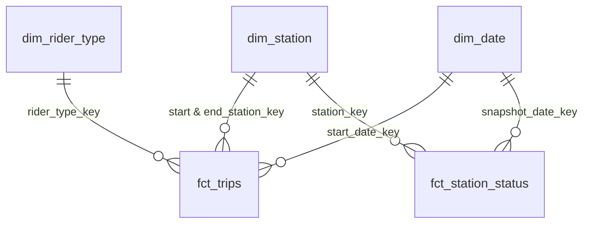
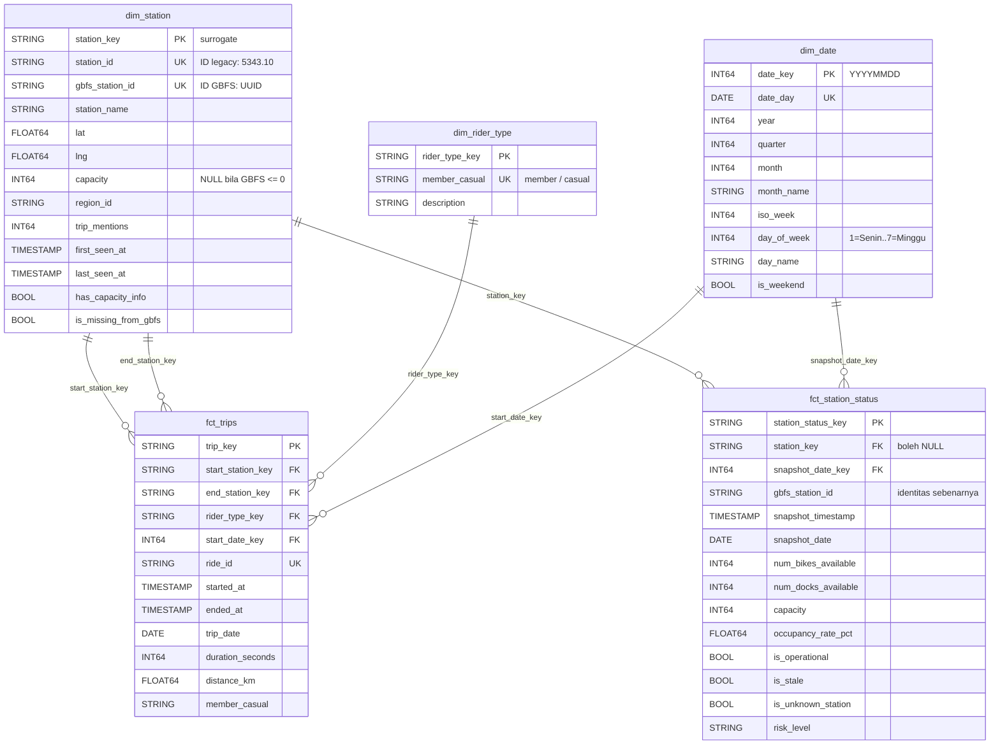
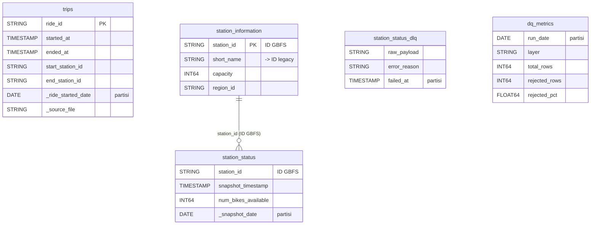
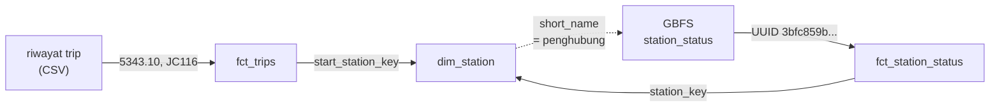
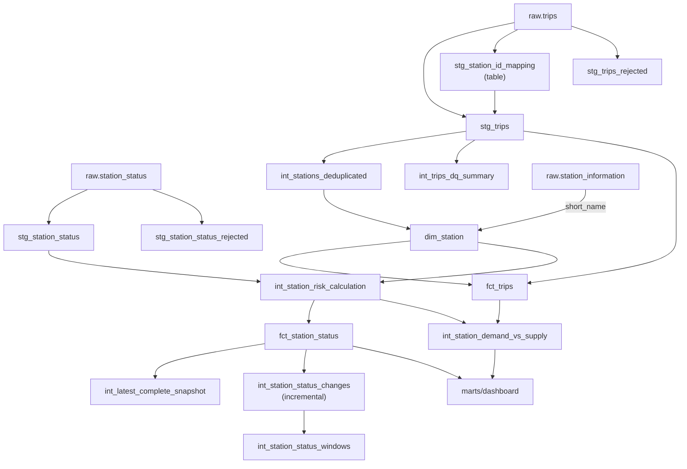

# ERD — Entity Relationship Diagram

Skema yang dipakai: **fact constellation** — dua fact table berbagi dua
dimensi.

---

## 1. Ringkasan relasi



| Fact | Tipe | Grain |
|---|---|---|
| `fct_trips` | Transaction fact | 1 baris per perjalanan |
| `fct_station_status` | Periodic snapshot fact | 1 baris per stasiun per polling |

Perbedaan tipe itu menentukan cara beragregasi: periodic snapshot memakai
`GROUP BY` bucket waktu, bukan validity window.

`dim_rider_type` hanya relevan untuk `fct_trips`, sedangkan `dim_station` dan
`dim_date` dipakai kedua fact.

---

## 2. Detail kolom



---

## 3. Layer raw



Catatan: `trips` tidak terhubung langsung ke tabel mana pun di layer raw.
Penghubungnya baru terbentuk di `dim_station` — lihat bagian 4.

---

## 4. `dim_station` sebagai jembatan dua ruang ID

Kedua fact table memakai gaya ID yang berbeda, dan `dim_station` yang
menghubungkannya. Inilah sebabnya dimensi tersebut menyimpan dua kolom ID.



**Masalahnya:** dua sumber **tidak saling mengenal**. Join langsung
`fct_trips.start_station_id = fct_station_status.gbfs_station_id`
menghasilkan **0 baris cocok** — bukan sebagian.

**Solusinya:** penghubungnya adalah kolom `short_name` pada GBFS, yang
ironisnya justru berisi ID legacy itu sendiri.

| Kolom | Dipakai oleh | Isi |
|---|---|---|
| `station_id` | `fct_trips` | legacy: `5343.10`, `JC116`, `HB602` |
| `gbfs_station_id` | `fct_station_status` | UUID / snowflake GBFS |

Konsekuensinya: trip dan status stasiun hanya dapat dibandingkan lewat
`dim_station`, tidak pernah secara langsung.

---

## 5. Aliran dari raw ke marts



`int_station_risk_calculation` (layer intermediate) membaca `dim_station`
(layer core), sehingga eksekusi dbt tidak dapat diurutkan per tag — intermediate
membutuhkan core lebih dulu. Karena itu DAG menjalankan
`dbt run --exclude tag:staging` dalam satu perintah dan membiarkan dbt
menentukan urutannya.

---

## 6. Materialisasi

| Layer | Materialisasi | Alasan |
|---|---|---|
| Staging | **view** | Hemat storage; dihitung saat dipakai |
| Intermediate | **view** | Sama |
| Marts core | **table** | Dipakai berulang; jadi dasar foreign key |
| Marts dashboard | **view** | Selalu segar mengikuti core |

**Pengecualian, beserta alasannya:**

| Model | Materialisasi | Alasan |
|---|---|---|
| `stg_station_id_mapping` | **table** | Dipakai 2× oleh `stg_trips`; kalau view akan memindai raw 1,1 GiB dua kali |
| `station_availability_realtime`, `station_risk_monitoring`, `station_supply_demand` | **table** | Di-auto-refresh tiap menit; kalau view, 1.440 refresh/hari menghabiskan kuota 1 TiB dalam ±3 hari |
| `int_station_status_changes` | **incremental** | Arsip perubahan; harus bertahan walau sumbernya dipangkas retensi |

---

## 7. Penanganan kasus khusus

Tiga hal berikut tidak terlihat di diagram, tetapi menentukan kebenaran relasi
antar tabel.

### 7.1 `capacity` NULL ≠ 0

26 stasiun dilaporkan GBFS berkapasitas **0**, dan satu stasiun
(`E 1 St & Bowery`) berkapasitas **1** padahal rutin menampung puluhan sepeda.

Kalau 0 dipakai apa adanya, `occupancy_rate_pct` menjadi bagi-nol. Karena itu:

```sql
CASE WHEN i.capacity > 0 THEN i.capacity END AS capacity
```

NULL berarti **tidak diketahui**, dan ditandai `has_capacity_info`. Nilai 0 dan
"tidak diketahui" diperlakukan berbeda.

### 7.2 `dim_date` diambil dari gabungan, bukan hanya trip

Kalau rentangnya hanya dari `stg_trips`, fact streaming akan punya tanggal di
luar dimensi → foreign key-nya gagal.

```sql
LEAST(MIN(trip_date), MIN(_snapshot_date))    -- batas bawah dari keduanya
```

Ditambah **buffer 7 hari ke depan**, karena `dim_date` dibangun DAG harian
sementara streaming berjalan tiap jam — tanpa buffer, snapshot lewat tengah
malam belum punya baris di dimensi.

### 7.3 Foreign key boleh NULL, tapi bukan hash dari nilai kosong

```sql
CASE WHEN start_station_id IS NOT NULL
     THEN {{ dbt_utils.generate_surrogate_key(['start_station_id']) }}
END AS start_station_key
```

Nilai NULL, bukan hash dari string kosong. Bila di-hash, kunci itu tidak akan
ditemukan di dimensi dan test `relationships` gagal — sedangkan NULL dilewati
test tersebut, sehingga maknanya terjaga.

Kasus serupa muncul di lapisan delta: `station_key` NULL untuk 82.531 baris
(9,9%), sehingga `int_station_status_changes` memakai `gbfs_station_id` sebagai
kunci perbandingan. Bila `station_key` dipakai, semua baris NULL masuk satu
partisi `LAG()` dan perubahan antar stasiun berbeda tercampur.

---

## 8. Angka nyata

| Entitas | Jumlah baris |
|---|---|
| `raw.trips` | 5.981.588 |
| `stg_trips` (valid) | 5.952.072 |
| `stg_trips_rejected` | 29.516 |
| `dim_station` | **2.285** (2.247 punya capacity, 38 tidak ada di GBFS) |
| `dim_date` | 267 hari (2025-12-31 … 2026-09-23) |
| `dim_rider_type` | 2 |
| `fct_trips` | 5.952.072 |
| `fct_station_status` | 837.683 |
| `int_station_status_changes` | 60.807 (7,26% dari fct) |
| `int_station_status_windows` | 60.807 |

**Rekonsiliasi yang dijaga test:**
`raw = valid + rejected` ✓ · `fct_trips = valid` ✓
