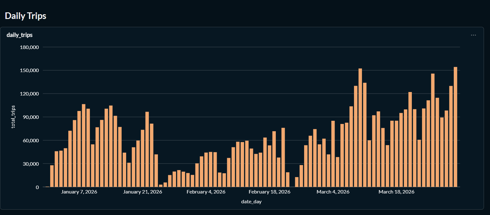
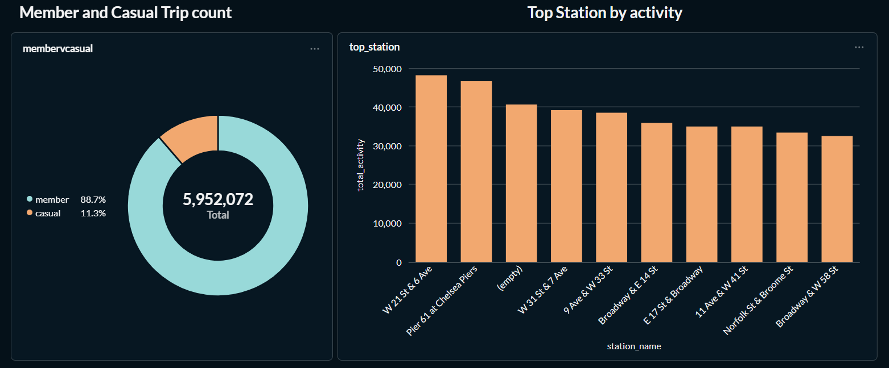
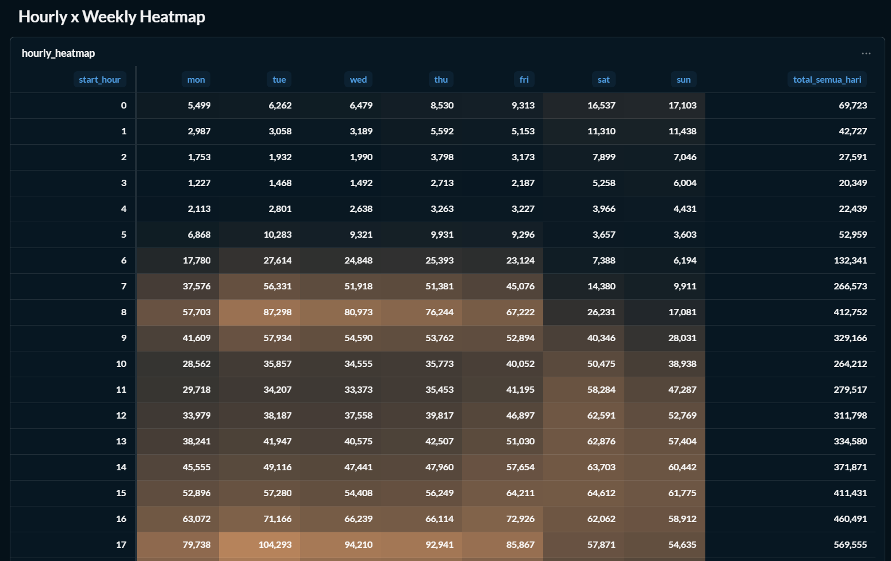
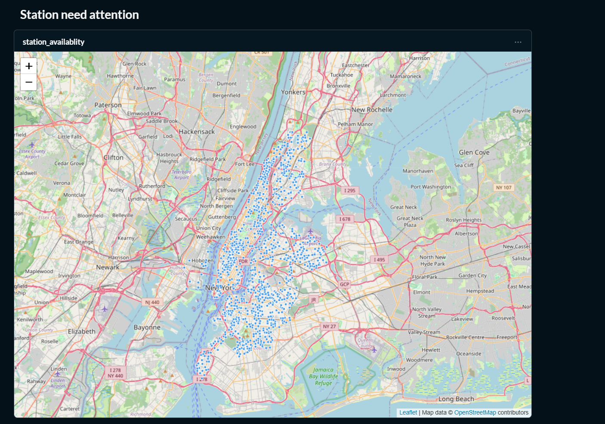
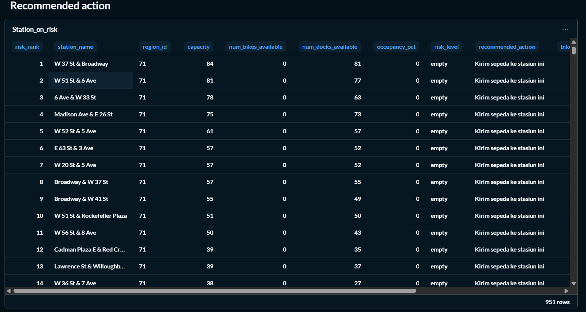
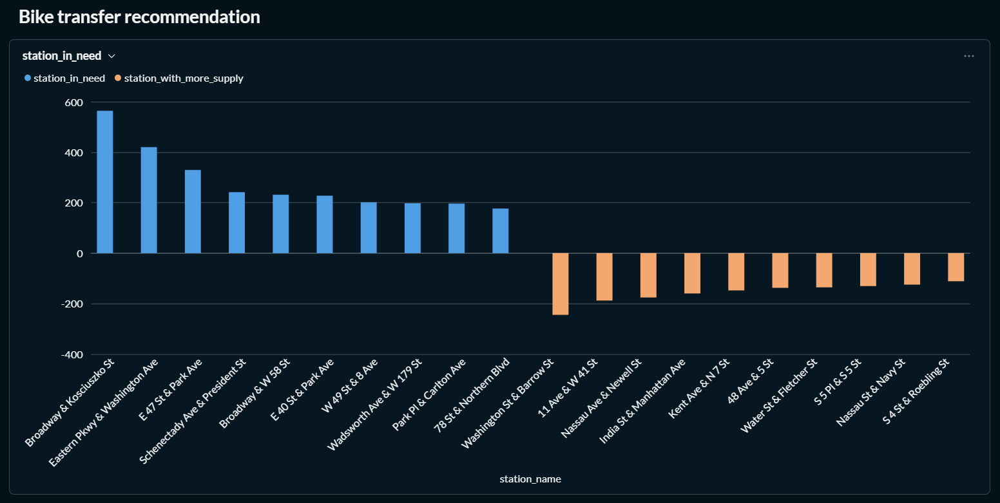
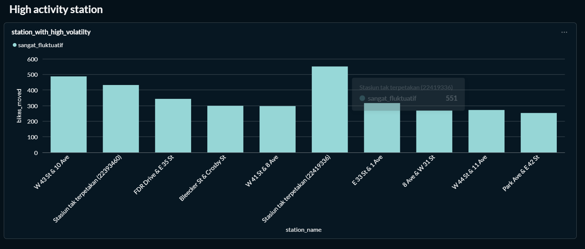

# Metabase — Catatan Setup

Metabase berjalan self-host lewat `docker-compose.yml`
(service `metabase` + application DB `metabase-db`).

**Panduan resep chart** (langkah, SQL, dan angka patokan verifikasi):

| Dokumen | Isi |
|---|---|
| [`dashboard_batch.md`](dashboard_batch.md) | Chart 1–4 dari data batch (tren, popularitas, pola jam, segmen pengguna) |
| [`dashboard_streaming.md`](dashboard_streaming.md) | Chart 5–8 dari data streaming (peta live, tabel risiko, supply vs demand, stasiun fluktuatif) |

## Hasil dashboard

Screenshot seluruh 8 chart ada di folder ini. Berguna sebagai **patokan
verifikasi**: kalau bentuk chart Anda berbeda jauh dari gambar di bawah,
penyebabnya biasanya ada di tabel Troubleshooting resep masing-masing.

### Dashboard batch (chart 1–4)

| Chart | Mart | Berkas |
|---|---|---|
| 1 · Tren trip harian | `trip_summary_daily` | `chart-1-daily-trips.png` |
| 2 · Top 10 stasiun tersibuk | `station_popularity` | `chart-3-dan-4-member-casual-dan-top-station.png` |
| 3 · Heatmap jam × hari | `usage_pattern_hourly` | `chart-2-hourly-heatmap.png` |
| 4 · Member vs casual | `member_vs_casual_behavior` | `chart-3-dan-4-member-casual-dan-top-station.png` |







### Dashboard streaming (chart 5–8)

| Chart | Mart | Berkas |
|---|---|---|
| 5 · Peta ketersediaan | `station_availability_realtime` | `chart-5-station-need-attention.png` |
| 6 · Tabel stasiun berisiko | `station_risk_monitoring` | `chart-6-recommended-action-for-station.png` |
| 7 · Supply vs demand | `station_supply_demand` | `chart-7-station-in-need-and-more-supply.png` |
| 8 · Stasiun fluktuatif | `station_volatility` | `chart-8-high-volatility-station.png` |









> ⚠️ **Penomoran nama berkas berbeda dari penomoran di dokumen resep.**
> `chart-2-hourly-heatmap.png` adalah **Chart 3** di resep, sedangkan
> `chart-3-dan-4-member-casual-dan-top-station.png` memuat **dua** chart:
> top stasiun (Chart 2) dan member vs casual (Chart 4). Isinya sama, hanya
> nomornya bergeser. Kalau ingin diseragamkan, dua berkas itu bisa di-rename:
>
> ```
> chart-2-hourly-heatmap.png                   -> chart-3-hourly-heatmap.png
> chart-3-dan-4-member-casual-dan-top-station.png -> chart-2-dan-4-batch-summary.png
> ```

## 1. Akses

| Item | Nilai |
|---|---|
| URL | http://localhost:3000 |
| Application DB | Postgres (`metabase-db`), volume `metabase-db` |
| Login pertama | buat akun admin saat wizard muncul |

## 2. Koneksi ke BigQuery

Metabase tidak bisa memakai file service account langsung dari path —
kredensial harus ditempel sebagai **JSON** di form koneksi.

Langkah:

1. Admin → **Databases** → **Add a database** → pilih **BigQuery**.
2. Isi:
   - **Display name**: `Citibike BigQuery`
   - **Project ID**: sesuai `GCP_PROJECT_ID` di `.env`
   - **Dataset ID**: `shuhaib_citibike_dashboard`
   - **Service account JSON**: tempel **seluruh isi**
     `secrets/service-account.json`
3. **Save** → **Sync database schema**.

> Service account butuh minimal `bigquery.dataViewer` + `bigquery.jobUser`
> untuk Metabase. Script `infra/gcp/create_service_account.sh` memberi
> `dataEditor` (lebih longgar); persempit ke `dataViewer` bila diinginkan.

## 3. Auto-refresh (untuk chart streaming)

Chart 5–7 perlu terlihat "hidup" saat demo, jadi butuh auto-refresh.
Chart 8 **tidak perlu** — ia dihitung dari arsip perubahan yang hanya
diperbarui DAG harian/jam-an, jadi angkanya memang tidak berubah per menit.

1. Buka dashboard → **...** → **Edit dashboard**.
2. Set **Auto-refresh** ke **1 minute**.
3. Simpan.

Ini aman dari sisi biaya karena mart yang di-auto-refresh dimaterialisasi sebagai
**table** berisi ±2.400 baris, bukan view yang memindai riwayat. Rincian
perhitungannya ada di [`dashboard_streaming.md`](dashboard_streaming.md).

> ⚠️ Bila kelak mart streaming diubah menjadi view, biaya query akan
> melonjak ratusan kali — interval auto-refresh harus disesuaikan. Chart 8
> sengaja tetap view karena sumbernya diperbarui tiap jam sementara ia dibangun
> harian.

## 4. Refresh source data

Jika tabel marts berubah (dbt run selesai), trigger manual:
**Admin → Databases → Citibike BigQuery → Sync database schema**.

## 5. Troubleshooting

| Gejala | Solusi |
|---|---|
| Metabase restart berulang | cek `docker compose logs metabase-db` — biasanya volume korup, `down -v` lalu up ulang |
| "No tables found" | pastikan dataset sudah di-sync dan nama dataset sesuai output dbt |
| Koneksi BigQuery timeout | service account salah/JSON tidak lengkap saat ditempel |
| Dashboard tidak update | cek auto-refresh aktif & dbt run terakhir sukses |
